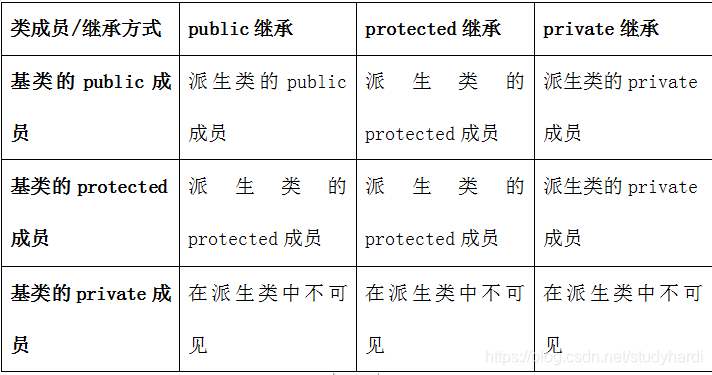

# 一、C++基础

## Q:说一下C++和C的区别？

- 设计思想上：

C++是面向对象的语言，而**C是面向过程的结构化编程语言**

- 语法上：

C++具**有封装、继承和多态**三种特性

C++相比C，**增加多许多类型安全的功能**，比如强制类型转换、**（C的类型转换是不一定安全的，比如double转int）**

C++支持**范式编程**，比如模板类、函数模板等


## Q:说一下C++和Java的区别？

**1.编译：**

​	Java源码会先经过一次编译，成为**中间码**，中间码再被解释器解释成机器码；C++源码一次编译，直接在编译的过程中链接了，形成了机器码。

**2.执行效率：**

​	C++比Java执行速度快，但是Java可以利用JVM跨平台。

 **3.面向对象：**

​	Java是纯面向对象的语言，**所有代码（包括函数、变量）都必须在类中定义**。而C++中还有面向过程的东西，比如是**全局变量和全局函数。**

**4.继承：**

​	 C++支持多继承，Java中类都是**单继承**的。

**5.内存管理：**

​	C++开发需要自己去管理内存，Java中JVM有自己的GC机制，不用程序员手动管理内存分配。


## Q:说一下c++和python在语言特性上的区别？

**语言分类：**

编译型语言、解释型语言、混合型语言

1.解释型语言

​	python，由解释器根据输入的数据当场执行而不生成任何的目标程序，**效率较慢**

2.编译型语言

​	c、c++

3.混合型语言

​	Java程序也需要编译，但是没有直接编译称为机器语言，而是编译称为字节码，然后在Java虚拟机上用解释方式执行字节码。


**区别：**

1、运行效率：C++ >> Python

2、开发效率：Python >> C++

1、代码形式
缩进：在Python，用不同级别的缩进表示不同级别的代码块。

全局变量：在函数内部是可以访问到全局变量的，但直接修改就不行。如果想要修改，可以使用global 标识 a 为全局变量

循环：在Python中，是使用可迭代对象（如字符串、列表、元组、字典、文件等）来构成循环


## Q:请你来回答一下const修饰成员函数的目的是什么？

const修饰的成员函数表明**函数调用不会对对象做出任何更改**，事实上，如果确认不会对对象做更改，就应该为函数加上const限定，**这样无论const对象还是普通对象都可以调用该函数。**

大家都可以调用的函数，但是又保证了不会对数据的更改。


## Q:常量指针，和指针常量的区别？

https://blog.csdn.net/weibo_dm/article/details/80445205

### 1.指针常量（* const p）

指针常量：顾名思义它就是一个常量，但是是指针修饰的。
**格式为：**

```cpp
int * const p //指针常量
```

**特性：**

- 指针指向的地址不能变
- 地址里面的内容可以变


### 2.常量指针（const *p）

常量指针：如果在定义指针变量的时候，数据类型前用const修饰

**格式：**

```cpp
const int *p = &a; //常量指针
```

**特性：**

- 指针的解引用（内容）不能变
- 指针的指向地址可以变


### 3.判断技巧

就看const后面跟的是什么，什么就不能变。

比如 const *p，后面跟的是 *p，他是指针的值，所以值不能变，指向可以变。

int * const p，那么后面跟的是p，p是指针的地址，所以指向不能变，值可以变。


## Q:char *p 和char p[]的区别？

### 1.读写的区别：

char* p是一个指针，**根本没分配内存**，**他指向的"abc123ABC" 是只读的，不能改变**，给他赋值肯定是错的而char p[]是一个数组，已经分配内存，是将"abc123ABC" 复制到该内存里面，**这个内存是可读写的**


从一般实现方式来看：
**char ca[]="abcd";**——**ca为局部变量（自动变量或寄存器变量）时具有自动存储期，放在运行期内存的栈中**；ca为全局或局部静态变量时具有静态存储期，放在内存的静态区；字符串字面量"abcd"具有静态存储期，放在文字常量区。这里，对象"abcd"作为一个右值用来初始化对象ca，两者不是同一回事。
**char* cb = "abcd";（这种用法在C++中为deprecated，应使用const char* cb = "abcd";代替）**——按指针引用cb和"abcd"时视为引用同一个对象（作为一元&和sizeof的操作数等左值语义上下文中时则不同），一般放在文字常量区。
**文字常量区是只读的**，而且更改字面量本身语义是不明确的，因此C++把字符串字面量视为字符串常量，禁止通过指针更改字面量本身。

```cpp
也即：
char ca[]="abcd";//这个是栈常量，可以修改。
char *cb = "abcd";//这个是字符串常量，存在文字常量区，地址受保护，只读。
```


### **2.分配地址的区别：**

```cpp
int a=0;    //全局初始化区，bss段
char *p1;   //全局未初始化区，bss段
main()
{
   int b;			//栈
   char s[]="abc";   //栈
   char *p2;         //栈
   char *p3="123456";   //123456\0在  文字常量区 ，  p3在栈上！！
   static int c=0；   //全局（静态）初始化区
   p1 = (char*)malloc(10);
   p2 = (char*)malloc(20);   //分配得来得10和20字节的区域就在堆区。
   strcpy(p1,"123456");   //123456\0放在常量区，编译器可能会将它与p3所向"123456"优化成一个地方。
}
```


### 3.存取效率的区别：

char s1[]="aaaaaaaaaaaaaaa";
char *s2="bbbbbbbbbbbbbbbbb";
aaaaaaaaaaa是在  **运行时刻**  赋值的；
而bbbbbbbbbbb是在  **编译时** 就确定的；

- 在以后的存取中，在栈上的数组比指针所指向的字符串(例如堆)快。

```cpp
voidmain()
{
    char a=1;
    char c[]="1234567890";
    char *p="1234567890";
    a = c[1];
    a = p[1];
    return;
}
```

第一种在读取时直接就把  **字符串中的元素读到寄存器cl中**  

而第二种则要  **先把指针值读到edx中，在根据edx读取字符**，显然慢了。


## Q:C++程序改错？


## Q:说一下C++中static关键字的作用

### 1.全局静态变量

作用：在全局变量前加上关键字static，**全局变量就定义成一个全局静态变量.**

存储区域：**静态存储区**，在整个程序运行期间一直存在。

初始化：**未经初始化的全局静态变量会被自动初始化为0！！**（自动对象的值是任意的，除非他被显式初始化）；

作用域：全局静态变量在**声明他的文件之外是不可见**的，准确地说是从定义之处开始，到文件结尾。

### 2.局部静态变量

在局部变量之前加上关键字static，局部变量就成为一个局部静态变量。

内存中的位置：**静态存储区**

初始化：**未经初始化的全局静态变量会被自动初始化为0**（自动对象的值是任意的，除非他被显式初始化）；

作用域：**作用域仍为局部作用域**，当定义它的函数或者语句块结束的时候，作用域结束。**但是当局部静态变量离开作用域后，并没有销毁，而是仍然驻留在内存当中**，只不过我们不能再对它进行访问，直到该函数再次被调用，并且值不变；

### 3.静态函数

作用：在函数返回类型前加static，函数就定义为静态函数。**函数的定义和声明在默认情况下都是extern的**，但静态函数只是在**声明他的文件当中可见，不能被其他文件所用**。

作用域：函数的实现使用static修饰，那么这个函数只可在本cpp内使用，**不会同其他cpp中的同名函数引起冲突**；

warning：不要再头文件中声明static的全局函数，不要在cpp内声明非static的全局函数，如果你要在多个cpp中复用该函数，就把它的声明提到头文件里去，否则cpp内部声明需加上static修饰；

### 4.类的静态成员

在类中，静态成员可以实现多个对象之间的数据共享，并且使用静态数据成员还不会破坏隐藏的原则，即保证了安全性。因此，**静态成员是类的所有对象中共享的成员**，而不是某个对象的成员。对多个对象来说，静态数据成员只存储一处，供所有对象共用。

- **类的静态成员，必须类内声明，类外初始化。**


### 5.类的静态函数

静态成员函数和静态数据成员一样，**它们都属于类的静态成员，它们都不是对象成员**。因此，对静态成员的引用不需要用对象名。

注意：

​	**因为没有this指针，在静态成员函数的实现中不能直接引用类中说明的非静态成员，可以引用类中说明的静态成员（这点非常重要）**。如果静态成员函数中要引用非静态成员时，可通过对象来引用。从中可看出，调用静态成员函数使用如下格式：<类名>::<静态成员函数名>(<参数表>);


## Q: 请你回答一下静态变量什么时候初始化？

静态变量存储在虚拟地址空间的  **数据段**（初始化）   和   **bss段**（未初始化）

C语言中其在**代码执行之前初始化，属于编译期初始化**。

C++中由于引入对象，对象生成必须调用构造函数，**因此C++规定全局或局部静态对象当且仅当对象首次用到时进行构造。**

c++中static对象是在用的时候构造。。。全局对象是在执行代码之前构造。


## Q:请你说extern 和 static 的区别，什么情况用前者什么情况用后者？

### c语言中的 static：

修饰局部变量：存放在静态数据区，生命周期位整个程序结束，但作用于仍为函数局部。
修饰全局变量：无法被同一工程其他源文件访问。
修饰函数：与全局变量类似。

### c语言中extern：

​	**可被同一工程其他源文件访问**

### c++中static：

修饰类中函数：表示该函数属于一个类，而不是此类的任何特定对象。
修饰类中变量：表示该变量为所有对象所有，在存储空间中只有一个副本。

### c++中extern

要调用其它文件中的函数和变量，只需把该文件用#include包含进来即可。**extern可加速程序的编译过程。**
C＋＋中调用C库函数，就需要在C＋＋程序中用extern “C”声明要引用的函数。**这是给链接器用的，告诉链接器在链接的时候用C函数规范来链接。**主要原因是   **C＋＋和C程序编译完成后在目标代码中命名规则不同，用此来解决名字匹配的问题（函数重载）**


## Q:为什么static静态变量要在类外初始化？

**答案：因为静态成员 和 类对象的生存周期的异步性**

这是因为被static声明的类静态数据成员，其实体远在main()函数开始之前就已经在全局数据段中诞生了！其生命期和类对象是异步的，（而且静态语意说明即使没有类实体的存在,其静态数据成员的实体也是存的）

这个时候对象的生命期还没有开始，如果你要到类中去初始化类静态数据成员,让静态数据成员的初始化依赖于类的实体,，那怎么满足前述静态语意呢?难道类永远不被实例化，我们就永远不能访问到被初始化的静态数据成员吗? 所以为了满足C++的static语意,static成员一定要在类外初始化!


## **Q:  explicit关键字**？

​	在C++中，我们有时可以将  **构造函数用作自动类型转换函数**  。但这种自动特性并非总是合乎要求的，有时会导致意外的类型转换，因此，**C++新增了关键字explicit，用于关闭这种自动特性**。即被explicit关键字修饰的类构造函数，不能进行自动地隐式类型转换，只能显式地进行类型转换。

​	注意：**只有一个参数**的构造函数，或者**构造函数有n个参数，但有n-1个参数提供了默认值**，这样的情况才能进行    **隐式类型转换**

```cpp
class Test
{
	public:
		explicit Test(int i); //加了一个explic关键字
};
Test t2 = 1;//编译报错，如果不加explicit关键字，编译器就会利用只有一个参数的构造函数 进行 int -> Test类型转换的过程，导致不安全
Test t2(2);//编译没问题

```

**总结**


## Q:请你说一下volatile、mutable、explicit关键字？


## Q:请你来说一说extern“C”？

**extern "C" 是用于C++链接在C语言模块中定义的函数。**

C++虽然部分兼容C，但C++文件中函数编译后生成的符号与C语言生成的不同。因为C++支持函数重载，**C++函数编译后生成的符号带有函数参数类型的信息**，而C则没有。

例如`int add(int a, int b)`函数经过C++编译器生成.o文件后，**`add`会变成形如`add_int_int`**之类的, 而C的话则会是形如`_add`, 就是说：相同的函数，在C和C++中，编译后生成的符号不同。

这就导致一个问题：**如果C++中使用C语言实现的函数，在编译链接的时候，会出错，提示找不到对应的符号。**此时`extern "C"`就起作用了：告诉链接器去寻找`_add`这类的C语言符号，而不是经过C++修饰的符号。

### C++调用C函数

​	C++调用C函数的例子: 引用C的头文件时，需要加`extern "C"`

### C中调用C++函数

​	在c文件中，用extern + 函数申明，即可在c文件使用cpp函数

```cpp
// add.h
#ifndef ADD_H
#define ADD_H
extern "C" {
    int add(int x,int y);
}
#endif

// add.cpp
#include "add.h"

int add(int x,int y) {
    return x+y;
}

// add.c
extern int add(int x,int y);  //这里在c文件中加上 extern int add这个函数即可
int main() {
    add(2,3);
    return 0;
}
```


## Q:请你说一下inline？

**内联能提高函数效率**，**但并不是所有的函数都定义成内联函数**！内联是以代码膨胀(复制)为代价，仅仅省去了函数调用的开销，从而提高函数的执行效率。

- 如果执行函数体内代码的时间相比于函数调用的开销较大，那么效率的收货会更少！
- 另一方面，每一处内联函数的调用都要复制代码，将使程序的总代码量增大，消耗更多的内存空间。

以下情况不宜用内联：

（1）如果**函数体内的代码比较长**，使得内联将导致内存消耗代价比较高。

（2）如果**函数体内出现循环**，那么执行函数体内代码的时间要比函数调用的开销大。


## Q:虚函数可以inline吗？

**不表现多态的时候的虚函数可以是内联函数，当虚函数表现多态性的时候不能内联。**

原因：

**内联是在编译器建议编译器内联，而虚函数的多态性在运行期（所谓动态链接，晚绑定），编译器无法知道运行期调用哪个代码，因此虚函数表现为多态性时（运行期）不可以内联。**

`inline virtual` 唯一可以内联的时候是：**编译器知道所调用的对象是哪个类**（如 `Base::who()`），这只有在编译器具有实际对象而不是对象的指针或引用时才会发生。


## Q:请你说一下你理解的C++中的smart pointer四个智能指针？

C++里面的四个智能指针: auto_ptr, shared_ptr, weak_ptr, unique_ptr **其中后三个是c++11支持，并且第一个已经被11弃用**。

总结版本：

|  智能指针  |                             特点                             |                       备注                       |
| :--------: | :----------------------------------------------------------: | :----------------------------------------------: |
|  auto_ptr  |      所有者模式，当所有权被剥夺不报错，有内存崩溃的危险      |               c++98提出、c++11弃用               |
| unique_ptr | 取代quto_ptr，独占式，可以临时右值赋值，不可以左值赋值，可以move将左值转为右值 |                                                  |
| shared_ptr |  共享式指针，计数器=0析构指针，构造时对应引用对象的计数器+1  |                                                  |
|  weak_ptr  |             弱引用的shared_ptr,不增加、减少计数              | 不可以通过它调用对象，必须lock函数转为shared_ptr |

### 为什么要使用智能指针？

智能指针的作用是管理一个指针，因为存在以下这种情况：**申请的空间在函数结束时忘记释放，造成内存泄漏。**

使用智能指针可以很大程度上的避免这个问题，**RAII机制**：**因为智能指针就是一个类，当超出了类的作用域是，类会自动调用析构函数**，**析构函数会自动delete释放资源**。所以智能指针的作用原理就是在函数结束时自动释放内存空间，不需要手动释放内存空间。

### auto_ptr

（c++98的方案，cpp11已经抛弃）

采用**所有权模式**。

```cpp
   auto_ptr< string> p1 (new string ("I reigned lonely as a cloud.”));
   auto_ptr<string> p2;
   p2 = p1; //auto_ptr不会报错.
```

此时不会报错，**p2剥夺了p1的所有权，但是当程序运行时访问p1将会报错。所以auto_ptr的缺点是：存在潜在的内存崩溃问题！**


### unique_ptr（替换auto_ptr）

**unique_ptr实现独占式拥有或严格拥有概念**，保证同一时间内只有一个智能指针可以指向该对象。它对于避免资源泄露(例如“以new创建对象后因为发生异常而忘记调用delete”)特别有用。

采用所有权模式，还是上面那个例子

```cpp
 unique_ptr p3 (new string ("auto"));  //#4unique_ptr p4；            //#5p4 = p3;//此时会报错！！
```

1.编译器认为p4=p3非法，避免了p3不再指向有效数据的问题。因此，unique_ptr比auto_ptr更安全。

2.另外unique_ptr还有更聪明的地方：

- **临时右值可以赋值**
- **已存在的左值不可赋值**

```cpp
unique_ptr<string> pu1(new string ("hello world"));
   unique_ptr<string> pu2;
   pu2 = pu1;                                      // #1 not allowed
   unique_ptr<string> pu3;
   pu3 = unique_ptr<string>(new string ("You"));   // #2 allowed
```

其中#1留下悬挂的unique_ptr(pu1)，这可能导致危害。而#2不会留下悬挂的unique_ptr，因为它调用 unique_ptr 的构造函数，**该构造函数创建的临时对象在其所有权让给 pu3 后就会被销毁**。这种随情况而已的行为表明，**unique_ptr 优于允许两种赋值的auto_ptr 。**

注：如果确实想执行类似与#1的操作，要安全的重用这种指针，可给它赋新值。**C++有一个标准库函数std::move()**，让你能够将一个unique_ptr赋给另一个。例如：

- std::move()函数可以将左值转换位右值，**这样就相当于变成临时右值。**

```cpp
   unique_ptr<string> ps1, ps2;
   ps1 = demo("hello");
   ps2 = move(ps1);  //这样是可以更换资源的，也就是移动语义。
   ps1 = demo("alexia");
   cout << *ps2 << *ps1 << endl;
```


### shared_ptr

shared_ptr实现**共享式拥有概念**。多个智能指针可以指向相同对象，该对象和其相关资源会在**“最后一个引用被销毁”时候释放**。从名字share就可以看出了资源可以被多个指针共享，**它使用计数机制来表明资源被几个指针共享**。可以通过成员函数use_count()来查看资源的所有者个数。

构造：**除了可以通过new来构造，还可以通过传入auto_ptr, unique_ptr,weak_ptr来构造。**

释放：当我们调用release()时，**当前指针会释放资源所有权**，**计数减一**。当计数等于0时，资源会被释放。

shared_ptr 是为了解决 auto_ptr 在对象所有权上的局限性(auto_ptr 是独占的), 在使用引用计数的机制上提供了可以共享所有权的智能指针。

成员函数：

- use_count 返回引用计数的个数
- **unique 返回是否是独占所有权( use_count 为 1)**
- swap 交换两个 shared_ptr 对象(即交换所拥有的对象)
- **reset 放弃内部对象的所有权或拥有对象的变更, 会引起原有对象的引用计数的减少**
- get 返回内部对象(指针), 由于已经重载了()方法, 因此和直接使用对象是一样的.如 shared_ptr sp(new int(1)); sp 与 sp.get()是等价的


### weak_ptr

weak_ptr 是一种不控制对象生命周期的智能指针, 它指向一个 shared_ptr 管理的对象. 进行该对象的内存管理的是那个强引用的 shared_ptr. weak_ptr只是提供了对管理对象的一个访问手段。**weak_ptr 设计的目的是为配合 shared_ptr 而引入的一种智能指针来协助 shared_ptr 工作, 它只可以从一个 shared_ptr 或另一个 weak_ptr 对象构造, 它的构造和析构不会引起引用记数的增加或减少。**

**weak_ptr是用来解决shared_ptr相互引用时的死锁问题**,如果说两个shared_ptr相互引用,那么这两个指针的引用计数永远不可能下降为0,资源永远不会释放。它是对对象的一种弱引用，不会增加对象的引用计数，和shared_ptr之间可以相互转化，shared_ptr可以直接赋值给它，**它可以通过调用lock函数来获得shared_ptr。**

**注意：**

​	**我们不能通过weak_ptr直接访问对象的方法**，比如B对象中有一个方法print(),我们不能这样访问，pa->pb*->print(); 英文pb*是一个weak_ptr，应该先把它转化为shared_ptr,如：shared_ptr p = pa->pb_.lock(); p->print();


## Q:请你说说你了解的RTTI？

**运行时类型检查Run Time Type Identification**

### RTTI机制的产生

​	C++是一种静态类型语言。其数据类型是在编译期就确定的，不能在运行时更改。**然而由于面向对象程序设计中多态性的要求，C++中的指针或引用(Reference)本身的类型，可能与它实际代表(指向或引用)的类型并不一致。**	有时我们需要将一个**多态指针转换为其实际指向对象的类型**，就需要知道运行时的类型信息，这就产生了运行时类型识别的要求。和Java相比，C++要想获得运行时类型信息，只能通过RTTI机制，并且C++最终生成的代码是直接与机器相关的。

### typeid和dynamic_cast操作符

​	RTTI提供了两个非常有用的操作符：typeid和dynamic_cast。

​	typeid操作符，**返回指针和引用所指的实际类型**；

​	dynamic_cast操作符，将基类类型的指针或引用**安全地转换**为其派生类类型的指针或引用。

​	我们知道C++的多态性（运行时）是由虚函数实现的，对于多态性的对象，无法在程序编译阶段确定对象的类型。当类中含有虚函数时，其基类的指针就可以指向任何派生类的对象，**这时就有可能不知道基类指针到底指向的是哪个对象的情况，类型的确定要在运行时利用运行时类型标识做出。**为了获得一个对象的类型可以使用typeid函数，**该函数反回一个对type_info类对象的引用**，要使用typeid必须使用头文件<typeinfo>，因为typeid是一个返回类型为typ_info的引用的函数所以这里有必要先介绍一下type_info类。


## Q:说一说C++中四种cast转换？

C++中四种类型转换是：static_cast, dynamic_cast, const_cast, reinterpret_cast

1、const_cast

用于将const变量转为非const，常用于指针转换，可以去除const、voalite属性

2、static_cast

用于**各种隐式转换**，比如非const转const，void*转指针等, **static_cast能用于多态向上转化，如果向下转能成功但是不安全，结果未知；**

- 多态子类 -》 父类：安全
- 多态父类 -》子类：不安全

3、dynamic_cast

用于**动态类型转换****。**只能用于含有虚函数的类****，用于类层次间的向上和向下转化。**只能转指针或引用**。向下转化时，如果是非法的对于指针返回NULL，对于引用抛异常。要深入了解内部转换的原理。

- 向上转换：指的是子类向基类的转换
- 向下转换：指的是基类向子类的转换

它通过判断在执行到该语句的时候**变量的运行时类型和要转换的类型是否相同**（用**RAII机制中的typeid**判断类型）来判断是否能够进行向下转换。

4、reinterpret_cast

几乎什么都可以转，比如将int转指针，可能会出问题，尽量少用；

5、为什么不使用C的强制转换？

C的强制转换表面上看起来功能强大什么都能转，**但是转化不够明确，不能进行错误检查，容易出错，且类型不安全**


## Q:请你来说一说C++的隐式类型转换？

**总结：**

​	隐式转换是编译器自主转换的，所以安全第一位，所以一定是从小到大的转换，int-》double，子-》父；

**什么是c++隐式类型转换？**

​	这是指c++自动将一种类型转换成另一种类型，是编译器的一种自主行为。

**为什么c++需要隐式类型转换？**

1. ​	c++多态的特性，就是通过父类的对象实现对子类的封装，以父类的类型返回之类对象。
2. ​	c++中使用父类的地方一定可以使用子类代替，这也得益于隐式类型转换。
3. ​	c++是一种**强类型**的语言，有着非常严格的类型检查，**采用隐式类型转换会使程序员更方便快捷一点。**
4. ​	但是在享受方便的时候，风险也紧跟其后。

```cpp
int i=3;
double j = 3.1;
i+j;//i会被转换成double类型，然后才做加法运算。

class A{};
class B: public A
{};//B是子类
void Fun(A& a);
B b;
Fun(b);//使用子类对象代替父类对象是可以的，也是因为隐式类型转换。这里是向上转换，是安全的。

```

有时候，隐式转换也不好：

```cpp
class Test
{
	public:
		Test(int i);
};

Test t1 = 1;//正确，由于强制类型转换，1先被Test构造函数构造成Test对象，然后才被赋值给t1
Test t2(1);//正确
```

### 容易忘记：

​	如上面的Test，对于**只存在单个参数的构造函数**的对象构造来说，函数调用可以直接使用该参数传入，编译器会自动调用其构造函数生成临时对象。他会将1穿进去生成临时对象，然后在拷贝赋值给t1；

- 再比如有函数用到Test类

```cpp
void fun(Test& t);
fun(1);//这样调用是没有问题的，隐式类型转换会把1转换成Test的对象。
```


## Q:请你回答一下智能指针有没有内存泄露的情况？

有。

当**两个对象相互使用一个shared_ptr成员变量指向对方，会造成循环引用**，使引用计数失效，从而导致内存泄漏。例如：


上述代码中，parent有一个shared_ptr类型的成员指向孩子，而child也有一个shared_ptr类型的成员指向父亲。然后在创建孩子和父亲对象时也使用了智能指针c和p，随后将c和p分别又赋值给child的智能指针成员parent和parent的智能指针成员child。从而形成了一个循环引用：


## Q:请你来说一下智能指针shared_ptr的实现？

`shared_ptr`使用**引用计数，每一个shared_ptr的拷贝都指向相同的内存。每使用它一次，内部的引用计数加1，每析构一次，内部的引用计数减1，减为0时，释放所指向的堆内存。**

共享指针，共享的是什么？

共享的是所有对象指向的内存，也就是**只有一个指针，只有一个房间。。。没人住了，才将房子收回。**


**原理：**

通过使用引用计数的方式来自动的对动态申请的内存进行释放，保证指针的生存期和安全性。
对智能指针初始化的时候，会将引用计数初始为1，**之后每次拷贝或移动赋值时，都对其引用计数加1.**
而在其生存期结束，要进行析构时，对其进行引用计数减一，如果引用计数为0，则释放原指针保存的空间。

**运算符重载：**

```cpp
 T& operator*();//解引用重载
 T* operator->();
```

也就是说，比如我们定义智能指针p；
那么在进行*p操作时，等同于对T&操作,而p->abcde操作时，等于(*p)->abcde;


**析构函数**

**拷贝构造函数**  和  **拷贝赋值运算符重载**
我们的**引用计数更改就是在上述函数内完成**的，当然需要自定义。
我在此三者基础上，还增加实现了**移动赋值的两个函数，搞得有点像标准的三五法则了**。
其实不然，因为我们这个程序所有传参中均不涉及深拷贝，所以我们并不需要用移动赋值，此处我只是以学习为目的，想使用右值引用和完美转发而已，读者切勿多想。

**代码：**

```cpp
//
//  Shared_ptr.hpp
//  demo
//
//  Created by shiyi on 2016/12/10.
//  Copyright © 2016年 shiyi. All rights reserved.
//

#ifndef Shared_ptr_Hpp
#define Shared_ptr_Hpp

#include <stdio.h>
#include <iostream>

using namespace std;

template <typename T>
class Shared_ptr
{
private:
    size_t* m_count;  //引用次数，共享次数
    T* m_ptr;  //真实的指针

public:
    //构造函数
    Shared_ptr() : m_ptr(nullptr), m_count(new size_t)
    {}

    Shared_ptr( T* ptr ) : m_ptr(ptr), m_count(new size_t)
    {
        cout<<"空间申请："<<ptr<<endl;
        *m_count = 1;  //共享次数加一
    }

    //析构函数
    ~Shared_ptr()
    {
        --(*m_count);
        if(*m_count == 0)  //说明自己是最后一个引用的，应该真的回收内存
        {
            cout<<"空间释放："<<m_ptr<<endl;
            delete m_ptr;
            delete m_count;
            m_ptr = nullptr;
            m_count = nullptr;
        }
    }

    //拷贝构造函数
    Shared_ptr( const Shared_ptr& ptr )
    {
        m_count = ptr.m_count;
        m_ptr = ptr.m_ptr;
        ++(*m_count);
    }

    //拷贝赋值运算符
    void operator=( const Shared_ptr& ptr )
    {
        Shared_ptr(std::move(ptr));  //将左值转为右值
    }

    //移动构造函数，，，，右值拷贝构造函数
    Shared_ptr( Shared_ptr&& ptr ) : m_ptr(ptr.m_ptr), m_count(ptr.m_count)
    {
        ++(*m_count);
    }
    //移动赋值运算符
    void operator=( Shared_ptr&& ptr )
    {
        Shared_ptr(std::move(ptr));
    }
    //解引用运算符
    T& operator*()
    {
        return *m_ptr;
    }
    //箭头运算符
    T* operator->()
    {
        return m_ptr;
    }
    //重载布尔值操作
    operator bool()
    {
        return m_ptr == nullptr;
    }
    T* get()  //对于shared_ptr来说，get是用来得到真实的指针
    {
        return m_ptr;
    }
    size_t use_count()  //对于shared_ptr来说，use_count是来返回引用次数的
    {
        return *m_count;
    }
    bool unique()   //对于shared_ptr来说，unique是用来判断自己是不是独占，也就是m_count==1？
    {
        return *m_count == 1;
    }
    void swap( Shared_ptr& ptr )
    {
        std::swap(*this, ptr);
    }
};
#endif /* Shared_ptr_Hpp */
```


## Q:请说一下C/C++ 中指针和引用的区别？

1.指针有自己的一块空间，而引用只是一个别名；

2.使用sizeof看一个指针的大小是4（32位系统），而引用则是被引用对象的大小；

3.指针可以被初始化为NULL，而**引用必须被初始化且必须是一个已有对象** 的引用；

4.作为参数传递时，指针需要被解引用才可以对对象进行操作，而直接对引用的修改都会改变引用所指向的对象；

5.**可以有const指针，但是没有const引用！！！！！；**

6.指针在使用中可以指向其它对象，但是**引用**只能是一个对象的引用，**不能被改变！！！**；

7.指针可以有多级指针（**p），而引用只有一级；

8.**指针和引用使用++运算符的意义不一样！！！！！一个是地址位置，一个是参数值；**

9.如果返回**动态内存分配的对象或者内存，必须使用指针**，**引用可能引起内存泄露。**（这个容易忘记）


## Q:请回答一下数组和指针的区别？

指针和数组的主要区别如下：

|                             指针                             |                     数组                     |
| :----------------------------------------------------------: | :------------------------------------------: |
|                      保存数据的**地址**                      |                   保存数据                   |
| 间接访问数据，首先获得指针的内容，然后将其作为地址，从该地址中提取数据 |                直接访问数据，                |
|                  **通常用于动态的数据结构**                  | 通常用于**固定数目**且**数据类型相同**的元素 |
|               通过Malloc分配内存，free释放内存               |               隐式的分配和删除               |
|            通常**指向匿名数据**，**操作匿名函数**            |                自身即为数据名                |


## Q:请你说一下数组名 和指针的联系和区别？

### 联系：

​	二者均可通过增减偏移量来访问数组中的元素。  

### 区别：

- 数组名不是真正意义上的指针，可以理解为**常指针**，所以   **数组名没有自增、自减等操作。**

- **当   数组名   当做  形参   传递给调用函数后，就失去了原有特性，退化成一般指针，多了自增、自减操作，但sizeof运算符不能再得到原数组的大小了。**  


## Q:请你说一下野指针、悬空指针?

- ### 悬空指针

C语言中的指针可以指向一块内存，**如果这块内存稍后被操作系统回收（被释放），但是指针仍然指向这块内存**，那么，此时该指针就是“悬空指针”。下面这段C语言代码是一个例子，请看：

```cpp
void *p = malloc(size);  //malloc返回的是void型指针
assert(p);
free(p); 
// 现在 p 是“悬空指针”
```

C语言中的“悬空指针”会引发不可预知的错误，而且这种错误一旦发生，很难定位。**这是因为在 free(p) 之后，p 指针仍然指向之前分配的内存，如果这块内存暂时可以被程序访问并且不会造成冲突，那么之后使用 p 并不会引发错误。**

解决：

​	**释放掉之后人为置空。**这么做的好处是一旦再次使用被释放的指针 p，**就会立刻引发“段错误”**，程序员也就能立刻知道应该修改C语言代码了

- ### 野指针

**“野指针”则是不确定其具体指向的指针**。“野指针”最常来自于未初始化的指针。

野指针就是指向一个   **已删除的对象 ** 或者  **未申请访问受限内存区域 **  的指针。

```cpp
void *p;
// 此时 p 是“野指针”
```

因为“野指针”可能指向任意内存段，因此它可能会损坏正常的数据，也有可能引发其他未知错误，所以C语言中的“野指针”危害性甚至比“悬空指针”还要严重。在实际的C语言程序开发中，定义指针时，一般都要尽量避免“野指针”的出现（赋初值）

解决：

​	**赋初值，置空。**


## Q:请你说一下函数指针，指针函数？

1、定义

**函数指针是指向函数的指针变量。**

函数指针本身首先是一个指针变量，该指针变量指向一个具体的函数。这正如用指针变量可指向整型变量、字符型、数组一样，这里是指向函数。

**C在编译时，每一个函数都有一个入口地址，该入口地址就是函数指针所指向的地址**。有了指向函数的指针变量后，可用该指针变量调用函数，就如同用指针变量可引用其他类型变量一样，在这些概念上是大体一致的。

2、用途：

**调用函数和做函数的参数，比如回调函数。**简单来说，函数作为别的函数的参数。

3、示例：

```cpp
char * fun(char * p) {…} // 指针函数

char * (*pf)(char * p); // 函数指针pf

pf = fun; // 函数指针pf指向函数fun

pf(p); // 通过函数指针pf调用函数fun
```


## Q:以下指针有什么区别？


 


## Q:请你说一说strcpy和strlen？

- **strcpy**

strcpy是字符串拷贝函数，原型：

char *strcpy(char* dest, const char *src);

从sr**c逐字节拷贝**到dest，**直到遇到'\0'结束**，因为没有指定长度，**可能会导致拷贝越界或者数据不全**，造成缓冲区溢出漏洞,安全版本是**strncpy函数（n的意思是前n个字符，类似于memcpy函数的count）。**


- **strlen**

 strlen函数是计算字符串长度的函数，返回从**开始到'0'之间的字符个数**。

比如，“hello”的结果是6，因为加上了**最后一个“\0”**


## Q:手撕strcpy函数？

要点：

- 使用assert断言函数，判断参数是否为NULL；
- 遇'\0'则停止赋值；
- 返回新的字符串的首地址

```cpp
char * strcpy(char *strDest, const char *strSrc ) 
{ 
    assert( (strDest != NULL) && (strSrc != NULL) );  //通过断言判断条件
    char *address = strDest;  
    while( (*strDest++ = * strSrc++) != ‘\0’ );  
    return address; //返回首地址，之前的strDest已经移到后面了
}
```

### 如果内存重叠呢？

在下面有更安全的版本。。。


## Q:strcpy和memcpy的区别，现场要求手撕代码？

### 1.区别与相同：

相同点：

- strcpy与memcpy都可以   **实现拷贝**   的功能

不同点：

- 实现功能不同，strcpy主要实现**字符串变量间的拷贝**，memcpy主要是**内存块间**的拷贝。

- 操作对象不同，strcpy的操作对象是**字符串**，memcpy 的操作对象是**内存地址**，**并不限于何种数据类型。**

- 执行效率不同，memcpy最高，strcpy次之。

### 2.手撕代码strcpy：

```cpp
char * strcpy(char *dst,const char *src)   //[1]
{
    assert(dst != NULL && src != NULL);    //[2]
    char *ret = dst;  //[3]
    while ((*dst++ = *src++)!='\0'); //[4]
    return ret;
}
```

### 3.strcpy代码解释：

**[1]const修饰**

​	源字符串参数用const修饰，  **防止修改源字符串**。

**[2]用断言assert空指针检查**

​	(A)不检查指针的有效性，说明答题者不注重代码的健壮性。

​	(B)检查指针的有效性时使用assert(!dst && !src); char *转换为bool即是类型隐式转换，这种功能虽然灵活，但更多的是导致出错概率增大和维护成本升高。

​	(C)检查指针的有效性时使用assert(dst != 0 && src != 0);

​	直接使用常量（如本例中的0）会减少程序的可维护性。而使用NULL代替0，如果出现拼写错误，编译器就会检查出来。

**[3]返回目标地址**

​	(A)忘记保存原始的strdstt值。

**[4]'\0'**

​	(A)循环写成while (*dst++=*src++);明显是错误的。

​	(B)循环写成while (*src!='\0') *dst++=*src++; 那么循环体结束后，**dst字符串的末尾没有正确地加上'\0'。**

​	(C)**这一步比较绕，其实是三步合成的。如下：**

```cpp
while ((*dst++ = *src++)!='\0'); //[4]

//第一步：将src里面的值复制给dst
*dst = *src;
//第二部：互相加加
dst++;
src++;
//第三步，执行括号外
*src != '\0';
```

**为什么是这样？**

- 假设上一把**src已经指向了倒数第二个字符**（不是"\0"），然后加加了，但是括号里面是复制表达式，由于是i++，所以返回的是原先的src，所以此时条件还满足，进入下一次循环。
- 那么进入while之后，就会将最后的“\0”字符也写进dst中，成功实现字符串变量的拷贝。


**为什么要返回char *？**

返回dst的原始值使函数能够支持   **链式表达式。**


### 4.假如考虑dst和src内存重叠的情况，strcpy该怎么实现

char s[10]="hello";

strcpy(s, s+1); //应返回ello，

//strcpy(s+1, s); //应返回hhello，但实际会报错，因为dst与src重叠了，把'\0'覆盖了

所谓重叠，就是src未处理的部分已经被dst给覆盖了，只有一种情况：src<=dst<=src+strlen(src)

**C函数memcpy自带内存重叠检测功能，下面给出memcpy的实现my_memcpy。**


### 5.手撕memcpy（内存重叠版）

```cpp
void* mymemcpy(void* dst, const void* src, size_t size)
{
	assert(dst != NULL && src != NULL);
	char* pdst = (char*)dst;//感觉是因为char为一个字节，所以一个字节一个字节的拷贝
	const char* psrc = (const char*)src;
    //判断是否有内存重叠
	if (pdst > psrc && pdst < psrc + size)
	{
        //选择从后往前复制，那么就不会有任何问题
		pdst = pdst + size - 1;
		psrc = psrc + size - 1;
		while (size--)
			*pdst-- = *psrc--;
	}
	else  //没有内存重叠
	{
		while (size--)
			*pdst++ = *psrc++;
	}
	return dst;
}
```


### 6.strcpy有什么危险？

**strcpy()调用时是遇到字符串结束'\0'就停止复制**，在处理一般的字符串时没有问题。

但用在数据接收发送时就会出问题，**我有一段16进制数据存在szBuffer[]里，然后用strcpy()拷贝到另外一个数组，另外一个数组有时就只有部分数据。原因在于数据里面有0x00，strcpy()遇到0x00就停止，于是就出现上述问题。**

最好还是用memcpy()这种有长度参数的函数。


## Q:请你来回答一下++i和i++的区别

++i先自增1，再返回，i++先返回i,再自增1

代码实现：


```cpp
A operator++()
{
	i = i+1;
	return *this;
}

A operator ++(int)
{
	A old = *this;
	++(*this);//增加
	return old; //返回增加之前的值
}
```


## Q:x=x+1, x+=1, x++ 哪个效率更高？

### 答案：x++效率最高。

**x=x+1最低**，因为它的执行过程如下：

（1）读取右x的地址。

（2）x+1.

（3）读取左x的地址。

（4）将右值传给左边的x（编译器并不认为左右x的地址相同）。


**x+=1其次**，其执行过程如下：

（1）读取右x的地址。

（2）x+1.

（3）将得到的值传给x（因为x的地址已经读出）。


**x++效率最高**，其执行过程如下：

（1）读取右x的地址。

（2）x自增1。


## Q:请你说说C++如何处理返回值？

函数的返回值用于初始化在调用函数是创建的临时对象。

1、返回值为**非引用类型**：

   会将函数的**返回值复制给临时对象**。跟实参初始化形参的方式一样。

2、返回值为**引用类型**：

  没有复制返回值，**返回的是对象本身**。**返回引用时，在函数的参数中要有以引用方式或指针方式传入的要返回的参数**，也就是说不能返回局部对象的引用。（因为函数执行结束，将释放分配给局部对象的存储空间，对局部对象的引用就会指向不确定的内存）。如果你的参数本身就没有指针或者引用，那你又不能返回局部变量的引用，那不是矛盾吗？

3. 返回**const 类型**：

**返回值不能被修改**。由于返回值直接指向了一个生命期尚未结束的变量，因此，对于函数返回值（或者称为函数结果）本身的任何操作，都在实际上，是对那个变量的操作，这就是引入**const**类型的返回的意义。当使用了**const**关键字后，即意味着函数的返回值不能立即得到修改！


# 二、STL

## Q:请你讲讲STL有什么基本组成？

在C++标准库函数中，STL主要包含**容器、算法、迭代器、函数对象、内存分配器和配接器**六部分。由于其中的代码采用模板类和模板函数的方式实现，因此STL可以提高代码的重用性，从而极大地提高编程效率。

1. **容器（Container）**是STL的一个重要组成部分，是指由STL定义的数据结构组成的模板类，其中包括vector、list、queue、set、map、multimap、stack、hash_set等。
2. **算法（Algorithm）**是以模板函数的方式提供，用来解决特定的问题，可对具有泛型数据结构的容器进行数据处理。在C++STL中提供了许多算法，这些算法包括排序、查找、搜索、修改、数值运算符。
3. **迭代器（Iterator）**也是STL的一个重要组成部分。STL通过迭代器可以定位和操纵容器，从而实现算法和容器关联。形象地说，迭代器类似与C中指针的概念。在STL中，除了作为容器适配器构造出来的堆栈容器（stack）、队列容器（queue）和优先队列容器（priority_queue）外，其他容器都有自己对应的迭代器。
4. **函数对象（Function Object）**是指将函数封装在一个对象中，使得它可以作为参数传递给合适的STL算法。一般来说，函数的传递可以用泛化的函数指针进行，使用函数对象的目的在于表达算法更加简洁，不依赖与当前硬件。在STL中，定义了许多函数对象，包括算术运算plus、minus、muliplies、divides、modulus、negate，比较运算以及逻辑运算。
5. **内存分配器（Allocator）**负责内存空间的配置与管理，是实现了内存空间的动态配置、管理、释放的模板类。内存分配器为若干对象的内存分配和释放提供类高级形式的调用，方便各种容器对数据进行内存管理。
6. **适配器（Adapter）**是一种修改容器、函数对象或迭代器接口的STL组件，**其作用相当于类型转换器**。适配器带有一个参数，其参数为适配器操作的数据类型。STL定义了3种形式的适配器：容器适配器、迭代器适配器和函数对象适配器。


## Q:STL是否是多线程安全？

**读安全：**

​	多个线程可以同时读取一个容器中的内容，eg: find, begin, end 等.

**写不安全：**

​	多个线程同时读写一个容器是很危险的。

以map为例：

当你调用map的任何接口时，比如 end(), begin(), find()等时，可能会返回一个iterator，如果有别的线程正在修改这个map，你的iterator就变得无效了，再用这个iterator行为就可能出问题；或者在find()函数内部，会访问到map内部的红黑树的数据结构，而这个红黑树是有可能被别的线程调整的(比如别的线程往map中插入一个新的记录)。所以，是危险的。

通常情况下，我们采取以下方法，可以做到线程安全的容器（就是在有写操作的情况下仍能保证安全）。

- **每次调用容器的成员函数的期间需要锁定。**

- **每个容器容器返回迭代器的生存期需要锁定。**

- **每个容器在调用算法的执行期需要锁定。**

  


## Q:请你来说一说STL迭代器删除元素？

### 迭代器失效：

1.对于**序列容器**vector,deque，stack来说，使用erase(itertor)后，**后边的每个元素的迭代器都会失效**，但是后边每个元素**都会往前移动一个位置**，但是**erase会返回下一个有效的迭代器，所以需要it来接受下一个有效的迭代器**；

解释：顺序容器删除iter之后，后面元素会上位一位，所以iter就变成了下一个元素了，所以失效，需要接受返回的下一个有效的，继续++

代码：

```cpp
for(auto iter = vec.begin();it != vec.end(); )
{
	if(*iter == target)
	{
		iter = vec.erase(iter);  //这里自己去接受下一个有效的迭代器
	}
	iter++; //自己去加1
}
```

2.对于**关联容器map set**来说，使用了erase(iterator)后，当前元素的迭代器失效，但是其结构是红黑树，删除当前元素的，不会影响到下一个元素的迭代器，**所以在调用erase之前，记录下一个元素的迭代器即可**。

解释：树形结构，删除iter之后，后面的数据都不会影响

```cpp
for(auto iter = map.begin();iter != map.end();)
{
	if(*iter == target)
	{
		map.erase(iter++); //先iter1删除，在自己++
		continue;
	}
	iter++;
}
```

3.对于list来说，它使用了**不连续分配**的内存，**并且它的erase方法也会返回下一个有效的iterator**，因此上面两种正确的方法都可以使用


## Q:请你来说一下STL中迭代器的作用，有指针为何还要迭代器？

### 1、迭代器

Iterator（迭代器）模式又称Cursor（游标）模式，用于**提供一种方法顺序访问一个聚合对象中各个元素, 而又不需暴露该对象的内部表示。**或者这样说可能更容易理解：Iterator模式是运用于聚合对象的一种模式，通过运用该模式，使得我们可以在不知道对象内部表示的情况下，按照一定顺序（由iterator提供的方法）访问聚合对象中的各个元素。

由于Iterator模式的以上特性：与聚合对象耦合，在一定程度上限制了它的广泛运用，一般仅用于底层聚合支持类，如STL的list、vector、stack等容器类及ostream_iterator等扩展iterator。

### 2、迭代器和指针的区别

**迭代器不是指针，是类模板，表现的像指针。**他只是模拟了指针的一些功能，通过重载了指针的一些操作符，->、*、++、--等。

**迭代器封装了指针，是一个“可遍历STL（ Standard Template Library）容器内全部或部分元素”的对象，** 本质是封装了原生指针，是指针概念的一种提升（lift），提供了比指针更高级的行为，**相当于一种智能指针**，他可以根据不同类型的数据结构来实现不同的++，--等操作。

**迭代器返回的是对象引用而不是对象的值**，所以cout只能输出迭代器使用*取值后的值而不能直接输出其自身。

### 3、迭代器产生原因

Iterator类的访问方式就是把**不同集合类的访问逻辑抽象出来，使得不用暴露集合内部的结构而达到循环遍历集合的效果。**


## Q: n个整数的无序数组，找到每个元素后面比它大的第一个数，要求时间复杂度为O(N)

**next greater num下一个更大的数**

### **单调栈：**

labuladong框架有，复习一下

一开始拿到题目，我们很容易想到对于每个元素，遍历它后面的元素就能找到第一个比它大的了，但是这样的话时间消耗可能会超过O(N)，因此在这当中可能会漏到很多信息，以至于我们每次都要去比较。那应该用什么呢？
可以设想一下：**如果我当前的处理对象是第1个元素，如果第2个元素比我小，那么我现在要做的不是去比较第3个元素与第1个元素的关系，而是将处理的对象变成第2个元素。**** **如果第3个元素比第2个元素大，我在回过来比较第1个元素****，这样是不是就省去了很多时间？

因此我们需要一个容器来存储未处理的元素，可以看到，**元素是后进先出的，比如第2个元素，后后到来却是先得到结果的**。因此我们可以用栈(stack) 来存储未处理的元素

```cpp
vector<int>  NextGreaterNum(vector<int> &num)
{
    int len=num.size();
    if(len==0) return {};    //空数组，返回空
    vector<int> res(len,-1);    //返回结果：初始化-1，表示未找到
    stack<int> notFind; //栈：num中还未找到符合条件的元素索引

    int i=0;
    while(i<len)    //遍历数组
    {
         //如果栈空或者当前num元素不大于栈顶，将当前元素压栈，索引后移，这就是单调栈
        if(notFind.empty() || num[notFind.top()]>=num[i])
        {
            notFind.push(i++);
        }
       //有待处理元素，且num当前元素大于栈顶索引元素，符合条件，更新结果数组中该索引的值，栈顶出栈。
        else
        {
            res[notFind.top()]=num[i];  //当前元素num[i]是top元素的下一个更大的数
            notFind.pop();
        } 
    }
 return res;
}
```


## Q:请你回答一下STL里resize和reserve的区别

**reserve**是**容器预留空间**，但并不真正创建元素对象，在创建对象之前，不能引用容器内的元素，因此当加入新的元素时，需要用push_back()/insert()函数。

**resize**是改变容器的大小，**并且创建对象**，因此，调用这个函数之后，就可以引用容器内的对象了，因此当加入新的元素时，用operator[]操作符，或者用迭代器来引用元素对象。


## Q:请你回答一下C++类内可以定义引用数据成员吗？

可以，必须通过成员函数初始化列表初始化。

除此之外，const成员也需要初始化列表初始化。

static成员需要类内声明，类外初始化。

```cpp
class A
{
public:
	int& m_a;
	const int m_b;
	static int m_c;
	A(int a,int b)m_a(a),m_b(b) //const，static初始化列表
	{}
};
A::m_c = 10; //static成员类外初始化
```


## Q:请你来介绍一下STL的allocaotr

### 1.分工精细

STL的**分配器 ** ：用于封装STL容器在内存管理上的底层细节。在C++中，其内存配置和释放如下：

- new运算分两个阶段：(1)调用::operator new配置内存;(2)调用对象构造函数构造对象内容
- delete运算分两个阶段：(1)调用对象希构函数；(2)调用::operator delete释放内存

为了精密分工，**STL allocator将两个阶段操作区分开来**：**内存配置有alloc::allocate()负责，内存释放由alloc::deallocate()负责；对象构造由::construct()负责，对象析构由::destroy()负责。**

### 2.两级配置器：

同时为了提升内存管理的效率，**减少申请小内存造成的内存碎片**问题，SGI STL采用了**两级配置器**

- ​	当**分配的空间大小  > 128B**时，会使用第一级空间配置器；
- ​	当**分配的空间大小 < 128B**时，将使用第二级空间配置器。

第一级空间配置器直接使用malloc()、realloc()、free()函数进行内存空间的分配和释放，而**第二级空间配置器采用了内存池**技术，通过**空闲链表**来管理内存。(操作系统的知识)


## Q:请你说一说C++ STL 的内存优化

### 两级空间配置器机制

**1.第一级配置器：**

第一级配置器是以malloc(),remalloc(),free()等C函数执行实际的内存配置，释放，重新配置等操作。一级空间配置器分配的是**大于128字节**的空间。如果分配失败，调用句柄释放一部分内存。如果还是失败，调用一个指定的函数。


**2.第二级配置器：**

如果要分配的**区块小于128字节**，则以  **内存池**  进行管理，内存池又称为次层配置器(sub-allocation):每次配置一大块内存，并维护对应的16个空闲链表(free-list)，下次若有相同大小的内存需求，直接从free-list中取，若有小额区块被释放，则由配置器回收到free-list中。

这里的**16个空闲链表分别管理大小为8，16，24，32，……，120，128B**的数据块。

这里的**空闲链表的结点设计为一个联合体Union**，既可以用来表示下一个空闲的数据块（存在于空闲链表中）的地址，也可以用来表示已经被用户使用的数据块（不存在与空闲链表中）的地址。

**什么意思呢？**

假设下面维护的是一个16位的free-list，现在第0位表示的是**长度位8B**的空闲区域的链表头结点。


现在假设要申请一个8B的空间，那么一看第0位就是8B的管家，就去申请，申请成功之后，此时第0位的指针指向了下一个地方，如下：

这样就实现了申请空间。


**申请过程：**

​	当用户申请的空间小于128字节，**首先将字节数扩大到8的倍数**，然后在自由链表中查找对应大小的子链表，如果在自由链表中查找不到或者块数不够，则向内存池进行申请，**一般一次申请20块**，如果不够分配20块，则分配最多的块数给自由链表，并且每次更新申请的块数。如果一块都无法提供，则把剩余的内存挂到自由链表，然后向堆申请空间，如果申请失败，则看看自由链表还有没有可用的块，如果也没有，最后调用一级空间配置器。

### 总结：

1. 使用allocate向内存池请求size大小的内存空间，如果需要请求的内存大小大于128bytes，直接使用malloc。

2. 如果需要的内存大小小于128bytes，allocate根据size找到最适合的**自由链表free-list**。 

   a. **如果链表不为空，返回第一个node，链表头改为第二个node。**

    b. 如果**链表为空**，使用**blockAlloc**请求分配node。

   ​	 x. 如果内存池中有大于一个node的空间，分配竟可能多的node(但是最多20个)，将一个node返回，其他的node添加到链表中。 	 y. 如果内存池只有一个node的空间，直接返回给用户。

   ​	 z. 若果**如果连一个node都没有**，再次向操作系统请求分配内存。

   ​		 ①分配成功，再次进行b过程。

   ​		 ②分配失败，**循环各个自由链表**，寻找空间。

   ​			 I. 找到空间，再次进行过程b。

   ​			 II. 找不到空间，抛出异常。

3. 用户调用deallocate释放内存空间，如果要求释放的内存空间大于128bytes，直接调用free。
4. 否则按照其大小找到合适的自由链表，**并将其插入。**


## Q: stl 相关容器，底层用什么实现的？

|      容器      |          底层          |                      备注                      |
| :------------: | :--------------------: | :--------------------------------------------: |
|     vector     |          数组          |                                                |
|      list      |        双向链表        |                                                |
|     deque      | 中央控制器和多个缓冲区 |                                                |
|     stack      | list或deque，封闭头部  | 不用vector的原因应该是容量大小有限制，扩容耗时 |
|     queue      | 一般用list或deque实现  |                                                |
| priority_queue |      一般为vector      |       堆heap为处理规则来管理底层容器实现       |
|      set       |         红黑树         |                  有序，不重复                  |
|    multiset    |         红黑树         |                  有序，可重复                  |
|      map       |         红黑树         |                  有序，不重复                  |
|    multimap    |         红黑树         |                  有序，可重复                  |
| unordered_set  |         hash表         |                  无序，不重复                  |
| unordered_map  |         hash表         |                  无序，不重复                  |


## Q:请你回答一下Array&List， 数组和链表的区别?

数组的特点：

- 数组是将元素在内存中**连续存放**，由于每个元素占用内存相同，可以通过下标迅速访问数组中任何元素。
- 数组的**插入数据和删除数据效率低**，插入数据时，这个位置后面的数据在内存中都要向后移。删除数据时，这个数据后面的数据都要往前移动。
- 数组的**随机读取效率很高。**因为数组是连续的，知道每一个数据的内存地址，可以直接找到给地址的数据。如果应用需要快速访问数据，很少或不插入和删除元素，就应该用数组。
- **数组需要预留空间**，在使用前要先申请占内存的大小，可能会浪费内存空间。并且数组不利于扩展，数组定义的空间不够时要重新定义数组。

链表的特点：

- 链表中的元素在内存中**不是顺序存储**的，而是通过存在元素中的指针联系到一起。比如：上一个元素有个指针指到下一个元素，以此类推，直到最后一个元素。如果要访问链表中一个元素，需要从第一个元素开始，一直找到需要的元素位置。
- **增加和删除一个元素对于链表数据结构就非常简单**了，只要修改元素中的指针就可以了。如果应用需要经常插入和删除元素你就需要用链表数据结构了。
- **不指定大小**，扩展方便。
- 链表大小不用定义，数据随意增删。

数组的优点：

1. 随机访问性强

2. 查找速度快

数组的缺点:

1. 插入和删除效率低

2. 可能浪费内存

3. **内存空间要求高**，必须有足够的连续内存空间。

4. 数组大小固定，不能动态拓展

链表的优点:

1. 插入删除速度快

2. **内存利用率高，不会浪费内存**

3. 大小没有固定，拓展很灵活。

链表的缺点:

​	不能随机查找，必须从第一个开始遍历，查找效率低


## Q:请你说一说vector和list的区别，应用，越详细越好？

### **1、概念：**

1）Vector

**连续存储**的容器，**动态数组**，在**堆上**分配空间

底层实现：**数组**

**两倍容量增长：**

- vector 增加（插入）新元素时，如果未超过当时的容量，则还有剩余空间，那么直接添加到最后（插入指定位置），然后调整迭代器。
- 如果没有剩余空间了，则会重新配置原有元素个数的**两倍空间**，然后将原空间元素通过**复制**的方式初始化新空间，再向新空间增加元素，最后析构并释放原空间，之前的迭代器会失效。

性能：

- 访问：**O(1)**
- 插入：在最后插入（空间够）：很快
- 在最后插入（空间不够）：需要内存申请和释放，以及对之前数据进行拷贝。
- 在中间插入（空间够）：**内存拷贝**
- 在中间插入（空间不够）：需要内存申请和释放，以及对之前数据进行拷贝。
- 删除：在最后删除：很快
- 在中间删除：内存拷贝

适用场景：经常随机访问，且不经常对非尾节点进行插入删除。

**2、List**

**动态链表**，在**堆**上分配空间，每插入一个元数都会分配空间，每删除一个元素都会释放空间。

底层：**双向链表**

性能：

- 访问：随机访问性能很差，只能**快速访问头尾节点**。
- 插入：**O(1),**很快，一般是常数开销
- 删除：**O(1),**很快，一般是常数开销

适用场景：经常插入删除大量数据

### 2、区别：

1）vector底层实现是数组；list是双向 链表。

2）vector支持随机访问，list不支持。

3）vector是顺序内存，list不是。

4）vector在中间节点进行插入删除会导致内存拷贝，list不会。

5）vector一次性分配好内存，不够时才进行2倍扩容；list每次插入新节点都会进行内存申请。

6）vector随机访问性能好，插入删除性能差；list随机访问性能差，插入删除性能好。

### 3、应用

vector拥有一段连续的内存空间，因此支持随机访问，如果需要高效的随即访问，而不在乎插入和删除的效率，使用vector。

list拥有一段不连续的内存空间，如果需要高效的插入和删除，而不关心随机访问，则应使用list。


## Q:vector扩容机制为什么成倍增长？为什么要1.5-2倍？

### vector扩容原理

1. Vector通过一个连续的数组存放元素，如果集合已满，在新增数据的时候，就要分配一块更大的内存，将原来的数据复制过来，释放之前的内存，在插入新增的元素；
2. 对vector的任何操作，一旦引起空间重新配置，**指向原vector的所有迭代器就都失效了** ；
3. 不同的编译器实现的扩容方式不一样，VS2019中以1.5倍扩容，GCC以2倍扩容。

### 为什么是成倍增长?

第一个问题：以成倍方式增长

假定有 n 个元素,倍增因子为 m

完成这 n 个元素往一个 vector 中的 push_back操作，需要重新分配内存的次数大约为 logm(n)

第 i 次重新分配将会导致复制 m^(i) (也就是当前的vector.size() 大小)个旧空间中元素

n 次 push_back 操作所花费的时间复制度为O(n)


m / (m - 1)是一个常量，均摊分析的方法可知，**vector 中 push_back 操作的时间复杂度为常量时间O(1)**

而如果是一次增加固定值，

那么最后均摊下来每一个push_back操作的时间复杂度为O（n）


### 为什么是以2倍或1.5倍的方式扩容而不是其他倍数呢？

使用 k=2 增长因子的问题在于，每次扩展的新尺寸必然刚好大于之前分配的总和：


也就是说，**之前分配的内存空间不可能被使用**。这样对于缓存并不友好。最好把增长因子设为 1 < k < 2

当 k =1.5 时，在几次扩展以后，可以重用之前的内存空间了

如下：


## Q.请你来说一说hash表的实现，包括STL中的哈希桶长度常数?

hash表的实现主要包括    **构造哈希**和    **处理哈希冲突**   两个方面：

### 构造哈希：

​	主要包括   **直接地址法、平方取中法、除留余数法**  等。

​	（1）直接定址法
​		取关键字的某个线性函数为散列地址：Hash（Key）= A*Key + B 优点：简单、均匀 缺点：需要事先 知道关键字的分布情况 使用场景：适合查找比较小且连续的情况。
​	（2）除留余数法
​		设散列表中允许的地址数为m，**取一个不大于m，但最接近或者等于m的质数p作为除数**，按照哈希函数：Hash(key) = key% p(p<=m),将关键码转换成哈希地址 。

### 处理哈希冲突：

​	对于处理哈希冲突来说，最常用的处理冲突的方法有    **开放定址法、再哈希法、链地址法、建立公共溢出区* **   等方法。SGL版本使用**链地址**法，使用一个链表保持相同散列值的元素。

​	虽然链地址法并不要求**哈希桶长度必须为质数**，但SGI STL仍然以质数来设计哈希桶长度，并且将28个质数（逐渐呈现大约两倍的关系）计算好，以备随时访问，同时提供一个函数，用来查询在这28个质数之中，“最接近某数并大于某数”的质数。


## Q.请你说一下哈希表的桶个数为什么是质数，合数有何不妥？

​	一个好的哈希函数需要让key分布的更均匀，这样哈西冲突的概率也会大大降低。

​	以质数作为模冲突会大大减少，原因：**质数的因子数（只有两个因子），而合数的因子数有多个（>=3）当一个数列关键码之间的差值越接近模的一个因子的时候，那么数列中的关键码在哈希表中映射的位置将会很不均匀**，而对于一个随机的数列，关键码之间的差值可能会是多种多样的，那么作为一个质数它的因子只有两个，因此差值与该质数因子相同的情况就会很少，而合数不同，它的因子数较多，那么关键码之间的差值与其因子相同的概率就会更高一些，由此导致关键码在哈希表中的位置分布不均匀，由此导致更严重的哈希冲突。


## Q.请你回答一下hash表如何rehash，以及怎么处理其中保存的资源？

- ### 负载因子loadFactor


​	C++的hash表中有一个**负载因子loadFactor**,**负载因子 = 哈希表已保存节点数量 / 哈希表大小（桶的数量）**

​	在介绍HashMap的内部实现机制时提到了两个参数，**DEFAULT_INITIAL_CAPACITY和DEFAULT_LOAD_FACTOR**，**DEFAULT_INITIAL_CAPACITY是table数组的容量，DEFAULT_LOAD_FACTOR则是为了最大程度避免哈希冲突，提高HashMap效率而设置的一个影响因子，将其乘以DEFAULT_INITIAL_CAPACITY就得到了一个阈值threshold，当HashMap的容量达到threshold时就需要进行扩容，这个时候就要进行ReHash操作了**，可以看到下面addEntry函数的实现，当size达到threshold时会调用resize函数进行扩容。

​	rehash过程中，会模仿C++的vector扩容方式，Hash表中每次发现loadFactor ==1时，**就开辟一个原来桶数组的两倍空间，称为新桶数组，然后把原来的桶数组中元素全部重新哈希到新的桶数组中。**

​	在扩容的过程中需要进行**ReHash**操作，而这是**非常耗时**的，在实际中应该尽量避免。


## Q.请你说一下解决hash冲突的方法?

​	当哈希表关键字集合很大时，**关键字值不同的元素可能会映象到哈希表的同一地址上，这样的现象称为哈希冲突**。目前常用的解决哈希冲突的方法如下：

​	**1.开放定址法**: 当发生地址冲突时，按照某种方法继续探测哈希表中的其他存储单元，直到找到空位置为止。

​	**2.再哈希法**：当发生哈希冲突时使用另一个哈希函数计算地址值，直到冲突不再发生。这种方法不易产生聚集，但是增加计算时间，同时需要准备许多哈希函数。

​	**3.链地址法**：将所有哈希值相同的Key通过**链表存**储。key按顺序插入到链表中

​	**4.建立公共溢出区**：采用**一个溢出表存储产生冲突的关键字**。如果公共溢出区还产生冲突，再采用处理冲突方法处理。


## Q:请你来说一下map和set有什么区别，分别又是怎么实现的？

**相同点：**

​	map和set都是C++的**关联容器**，其底层实现都是**红黑树（RB-Tree）**。由于 map 和set所开放的各种操作接口，RB-tree 也都提供了，所以几乎所有的 map 和set的操作行为，都只是转调 RB-tree 的操作行为。

**区别：**

（1）map中的元素是key-value（关键字—值）对：关键字起到索引的作用，值则表示与索引相关联的数据；Set与之相对就是关键字的简单集合，set中每个元素只包含一个关键字。

（2）**set的迭代器是const的，不允许修改元素的值；** **map允许修改value，但不允许修改key**。其原因是因为map和set是根据关键字排序来保证其有序性的，如果允许修改key的话，那么首先需要删除该键，然后调节平衡，再插入修改后的键值，调节平衡，如此一来，严重破坏了map和set的结构，**导致iterator失效**，不知道应该指向改变前的位置，还是指向改变后的位置。所以STL中将set的迭代器设置成const，不允许修改迭代器的值；而map的迭代器则不允许修改key值，允许修改value值。

（3）**map支持下标操作，set不支持下标操作**。map可以用key做下标，**map的下标运算符[ ]将关键码作为下标去执行查找，如果关键码不存在，则插入一个具有该关键码和mapped_type类型默认值的元素至map中，因此下标运算符[ ]在map应用中需要慎用，**const_map不能用，只希望确定某一个关键值是否存在而不希望插入元素时也不应该使用，mapped_type类型没有默认值也不应该使用。如果find能解决需要，尽可能用find。


## Q:请你说说STL中map与unordered_map

1、Map：

映射，map 的所有元素都是 **pair**，同时拥有实值（value）和键值（key）。pair 的第一元素被视为键值，第二元素被视为实值。所有元素都会根据元素的键值自动被排序。**不允许键值重复。**

底层实现：**红黑树**

适用场景：有序键值对，不重复映射

2、Multimap

**多重映射。**multimap 的所有元素都是 **pair，**同时拥有实值（value）和键值（key）。pair 的第一元素被视为键值，第二元素被视为实值。所有元素都会根据元素的键值自动被排序。允许键值重复。

底层实现：**红黑树**

适用场景：有序键值对，可重复映射

区别：与map相比，multimap取消了operaator[]，也就是说，**只能insert插入键值对，不能用下表操作符[]**

代码：

```cpp
#include <iostream>
#include <map>
#include <algorithm>
using namespace std;

int main()
{
	multimap<string, string> multi;
	//1.insert插入
	multi.insert(make_pair("192.168.1.10","www.baidu.com"));
	multi.insert(make_pair("192.168.1.10", "www.sina.com"));
	multi.insert(make_pair("192.168.1.10", "www.qq.com"));
	multi.insert(make_pair("192.168.1.11", "www.weibo.com"));
	multi.insert(make_pair("192.168.1.12", "www.wechat.com"));

	//2.find查找,返回“第一个匹配”的迭代器，注意是第一个
	auto iter = multi.find("192.168.1.10");
	cout << iter->second << endl;  //www.baidu.com

	//3.count查找，返回匹配对象的个数
	//3.1 equal_range():返回pair，其中里面存的是“迭代器的起止范围”
	pair<multimap<string, string>::iterator, multimap<string, string>::iterator> range = multi.equal_range("192.168.1.10");
	for (auto it = range.first; it != range.second; it++)
	{
		cout << it->second << endl;
	}
	//3.2 lower_bound(k) 查找第一个与键 k 关联的值
	cout << multi.lower_bound("192.168.1.10")->second << endl; //www.baidu.com

	//3.3 upper_bound(k) 是查找第一个键值比 k 大的元素。
	cout << multi.upper_bound("192.168.1.10")->second << endl; //www.weibo.com

	return 0;
}

```


3、unordered_map

映射，元素都是pair，不过不会自动按照key来排序，且不允许键值key重复

底层实现：**哈希表**

使用场景：无序键值对，不可重复映射


## Q:请你回答一下map底层为什么用红黑树实现?

红黑树较AVL树的优点：

- AVL 树是高度平衡的，频繁的插入和删除，会引起频繁的rebalance，导致效率下降；
- 红黑树不是高度平衡的，算是一种折中，**插入最多两次旋转，删除最多三次旋转**。

所以**红黑树在查找，插入删除的性能都是O(logn)，且性能稳定**，所以STL里面很多结构包括map底层实现都是使用的红黑树。


## Q:请你来说一说红黑树和AVL树的定义，特点，以及二者区别？

### 平衡二叉树（AVL树）：

平衡二叉树又称为AVL树，是一种特殊的二叉排序树。其左右子树都是平衡二叉树，且左右子树高度之差的绝对值不超过1。一句话表述为：**以树中所有结点为根的树的左右子树高度之差的绝对值不超过1。**将二叉树上结点的左子树深度减去右子树深度的值称为   **平衡因子BF**，那么平衡二叉树上的所有结点的平衡因子只可能是-1、0和1。只要二叉树上有一个结点的平衡因子的绝对值大于1，则该二叉树就是不平衡的。

### 红黑树：

红黑树是一种二叉查找树，但在每个节点增加一个存储位表示节点的颜色，可以是红或黑（非红即黑）。**通过对任何一条从根到叶子的路径上各个节点着色的方式的限制，红黑树确保没有一条路径会比其它路径长出两倍，因此，红黑树是一种弱平衡二叉树**，相对于要求严格的AVL树来说，**它的旋转次数少**，所以对于搜索，插入，删除操作较多的情况下，通常使用红黑树。

性质：

1. 每个节点非红即黑

2. **根节点是黑的;**

3. 每个叶节点（叶节点即树尾端NULL指针或NULL节点）都是黑的;

4. **如果一个节点是红色的，则它的子节点必须是黑色的**。

5. 对于任意节点而言，其到叶子点树NULL指针的每条路径都包含相同数目的黑节点;

### 区别：

- AVL 树是高度平衡的，频繁的插入和删除，会引起频繁的rebalance，导致效率下降；
- 红黑树不是高度平衡的，算是一种折中，**插入最多两次旋转，删除最多三次旋转**。


## Q：请你说一说红黑树的具体插入、删除的操作？

https://www.jianshu.com/p/96e652ccf720

- ### 插入操作insert

  首先，插入的节点的颜色 **默认为红色**，因为一旦是黑色，那就没用了，因为所有的要求规则都是针对红色的。	

插入一个红色节点之后，可能会引起树的失衡（上面图片中的要求不满足），所以需要调整

​	调整的方法有两种：

1. **变色**

2. **旋转**（左旋、右旋）

   


### 情形1. N为根节点（父节点为NULL）

当前平衡节点N为根节点时，直接涂黑根节点即可。


N为根节点

### 情形2. 父黑

父节点为黑色时，无需其他操作，已然平衡。


父黑

### 情形3. 父红-叔红

父红-叔红时，将父/叔节(P/U)点涂黑，祖父节点(GP)涂红；而后以祖父节点(GP)作为新的平衡节点N，**递归执行平衡操作。**


i情形3 父红-叔红

### 情形4. 父红-叔黑

#### 情形4.1 父节点和N同一边

- #### 父N同左

“父N同左”指的是：**父节点为祖父节点的左子，N为父节点的左子**。
 此时以  **祖父节点(GP)**  为支点进行  **右旋**  ；然后将P涂黑，将GP涂红。


旋转后，P涂黑是因为要涂为原GP的黑色（往上兼容GP的父节点）；而GP涂红则是因为右旋后，经过U的路径的黑色节点数量+1，涂红进行数量平衡；下同。

- #### 父N同右

“父N同右”指的是：**父节点是祖父节点的右子，N为父节点的右子**。
 此时以**祖父节点(GP)**为支点进行**左旋**；将P涂黑，将GP涂红。


### 情形4.2 父节点和N不在同一边

- ####  父左N右

“父左N右”指的是：**父节点是祖父节点的左子，N为父节点的右子**。
 此时，以**父节点(P)**进行**左旋**，旋转后，**以P作为新的平衡节点N，转至 [情形4.1.1 父N同左] 处理，在进行以祖父节点的右旋**


- ####  父右N左

“父右N左”指的是：**父节点是祖父节点的右子，N为父节点的左子**。
 此时，以 **父节点(P)**进行**右旋**，旋转后，以P作为新的平衡节点，**此时再进行【情形4.1.2 父N同右】处理，在进行以祖父节点的左旋**。


#### 4. 插入总结与实例

首先是先插入再说；插入后，以刚插入的节点作为当前平衡节点N，进行平衡操作。现在回头看插入平衡的这几种情形，其实并不复杂：

1. N为根：涂黑完事；
2. 父黑：啥事不用管；
3. 父红叔红：父/叔涂黑，祖父涂红，然后把祖父当成新的平衡节点递归处理（我们下面平衡了，让他老人家和上面沟通吧）；
4. 父红叔黑：父节点和新插入节点同一边的话，扭一下就完事了（同左右旋，同右左旋，顺便涂色）；不在同一边的话，先扭到同一边吧。


## Q：左旋、右旋操作？

**左旋：**

- 条件：父节点为红色，叔叔节点为黑色，且当且节点在父节点的右子树
- 操作：和AVL一样，以**父节点作为旋转中心**左旋


- 步骤：

  ```cpp
  Node* temp = root->right;  
  root->right = temp->left;  
  temp->left = root;  	
  root = temp;
  ```

  

  


**右旋：**

- 条件：父节点为红色，叔叔节点为黑色，且当且节点在父节点的左子树
- 操作：把父节点变为黑色，祖父节点变为红色，以**祖父节点为旋转中心**右旋


## Q: 请你聊一聊哈夫曼编码?

哈夫曼编码是哈夫曼树的一种应用，广泛用于数据文件压缩。

哈夫曼编码算法用字符在文件中出现的频率来建立使用0，1表示个字符的最优表示方式，其具体算法如下：

(1)**哈夫曼算法以自底向上的方式构造表示最优前缀码的二叉树T。**

(2)算法以|C|个叶结点开始，执行|C|－1次的“合并”运算后产生最终所要求的树T。

(3)假设编码字符集中**每一字符c的频率是f(c)**。以f为键值的优先队列Q用在贪心选择时有效地确定算法**当前要合并的2棵具有最小频率的树**。一旦2棵具有最小频率的树合并后，产生一棵新的树，**其频率为合并的2棵树的频率之和**，并将新树插入优先队列Q。经过n－1次的合并后，优先队列中只剩下一棵树，即所要求的树T


## Q: 请你介绍一下B树、B+树？

参考：https://www.bilibili.com/video/BV1p7411k7nU/?spm_id_from=333.788.recommend_more_video.0

### 1.为什么出现B树？

​	传统用来搜索的平衡二叉树有很多，如 AVL 树，红黑树等。这些树在一般情况下查询性能非常好，但当数据非常大的时候它们就无能为力了。**原因当数据量非常大时，内存不够用，大部分数据只能存放在磁盘上，只有需要的数据才加载到内存中。**一般而言内存访问的时间约为 50 ns，而磁盘在 10 ms 左右。**速度相差了近 5 个数量级**，磁盘读取时间远远超过了数据在内存中比较的时间。**这说明程序大部分时间会阻塞在磁盘 IO 上。**那么我们如何提高程序性能？减少磁盘 IO 次数，像 AVL 树，红黑树这类平衡二叉树从设计上无法“迎合”磁盘。

​	平衡二叉树是通过**旋转来保持平衡**的，而旋转是对**整棵树的操作**，若部分加载到内存中则无法完成旋转操作。其次平衡二叉树的高度相对较大为 log n（底数为2），**这样逻辑上很近的节点实际可能非常远，无法很好的利用磁盘预读（局部性原理）**，所以这类平衡二叉树在数据库和文件系统上的选择就被 pass 了。


### 2.磁盘搜索的树？

​	索引的效率依赖与磁盘 IO 的次数，快速索引需要有效的减少磁盘 IO 次数**。**

​	**如何快速索引呢？索引的原理其实是不断的缩小查找范围，就如我们平时用字典查单词一样，先找首字母缩小范围，再第二个字母等等。平衡二叉树是每次将范围分割为两个区间。为了更快，**B-树每次将范围分割为多个区间，区间越多，定位数据越快越精确。那么如果节点为区间范围，每个节点就较大了**。所以新建节点时，直接申请页大小的空间（磁盘存储单位是按 block 分的，一般为 512 Byte。**磁盘 IO 一次读取若干个 block，我们称为一页**，具体大小和操作系统有关，一般为 4 k，8 k或 16 k），计算机内存分配是按页对齐的，这样就实现了一个节点只需要一次 IO。


### 3.磁盘构造

磁盘是一个扁平的圆盘(与电唱机的唱片类似)。盘面上有许多称为**磁道的圆圈**，数据就记录在这些磁道上。磁盘可以是单片的，也可以是由若干盘片组成的盘组，每一盘片上有两个面。如下图11.3中所示的6片盘组为例，**除去最顶端和最底端的外侧面不存储数据之外，**一共有10个面可以用来保存信息。


​	当磁盘驱动器执行读/写功能时。**盘片装在一个主轴上，并绕主轴高速旋转，当磁道在读/写头(又叫磁头) 下通过时，就可以进行数据的读 / 写了。**

- 磁盘读取数据是以**盘块(block)**为基本单位的。**一个扇区为512B，每次都一次性读取8哥扇区。**

  位于同一盘块中的所有数据都能被一次性全部读取出来。而磁盘IO代价主要花费在查找时间Ts上。因此我们应该尽量将相关信息存放在同一盘块，同一磁道中。或者至少放在同一柱面或相邻柱面上，以求在读/写信息时尽量减少磁头来回移动的次数，避免过多的查找时间Ts。


### 4.B树

​	一般的二叉搜索树可以将查找的时间复杂度降为O(lon2N),但是**B树可以将底数2改为t，大大降低了树的高度。**


**查找：**


- 图中的**小红方块表示对应关键字所代表的文件的存储位置，**实际上可以看做是一个地址，比如根节点中17旁边的小红块表示的就是关键字17所对应的文件在硬盘中的存储地址。

- **P是指针**，不用多说了，需要注意的是：指针，关键字，以及关键字所代表的文件地址这三样东西合起来构成了B树的一个节点，这个节点存储在一个磁盘块上

下面，看看搜索**关键字的29**的文件的过程：

1. 从根节点开始，读取根节点信息，根节点有2个关键字：17和35。因为17 < 29 < 35，所以找到**指针P2**指向的子树，也就是磁盘块3（**1次I/0操作**）

2. 读取当前节点信息，当前节点有2个关键字：26和30。26 < 29 < 30，找到指针P2指向的子树，也就是磁盘块8（**2次I/0操作）**

3. 读取当前节点信息，当前节点有2个关键字：28和29。找到了！**（3次I/0操作）**

### 5.B+树

​	B+树是B-树的变体，也是一种  **多路平衡搜索树**  , 它与 B- 树的不同之处在于:

1. **所有关键字存储在叶子节点,内部节点(非叶子节点）并不存储真正的 data，只是提供一个查找方向**
2. **为所有叶子结点增加了一个链指针，也就是说，所有的叶子节点其实是一个链表！！！，所有的叶子结点中包含了全部元素的信息，及指向含这些元素记录的指针，且叶子结点本身依关键字的大小自小而大顺序链接**


解释：

- 比如要找20，那么在根节点一看，小于25的往左走，这个只是指明了一个方向，但是没有存值，值都存在最下面的叶子节点。


### 6.B-树和B+树的区别

​	1.**单一节点存储更多的元素**（这样该节点下分支变多了，树变矮胖了），使得  **查询的IO次数更少**  。

​	2.**所有查询都要查找到叶子节点**，查询性能稳定。B树最好在根节点，最坏到叶子节点，性能不稳定。B+树每一次都到叶子节点，性能稳定。

​	3.所有 **叶子节点**  形成  **有序链表**  ，便于  **范围查询**。


## Q.请说一说你理解的stack overflow，并举个简单例子导致栈溢出？

### 栈溢出概念：

栈溢出指的是**程序向栈中某个变量中写入的字节数超过了这个变量本身所申请的字节数**，因而导致栈中与其相邻的变量的值被改变。

### 栈溢出的原因：

1. **局部数组过大**。当函数内部的数组过大时，有可能导致堆栈溢出。局部变量是存储在栈中的，因此这个很好理解。解决这类问题的办法有两个，一是增大栈空间,二是改用动态分配，使用堆（heap）而不是栈（stack）。

2. **递归调用层次太多、死循环**。递归函数在运行时会执行压栈操作，当压栈次数太多时，也会导致堆栈溢出。

3. **指针或数组越界**。这种情况最常见，例如进行字符串拷贝strcpy，或处理用户输入等等。


## Q:请你回答一下栈和堆的区别，以及为什么栈要快?

### 堆和栈的区别：

- **扩展方向：  堆是由低地址向高地址扩展；栈是由高地址向低地址扩展**
- **手动与自动：**堆中的内存需要手动申请和手动释放；栈中内存是由OS自动申请和自动释放，存放着参数、局部变量等内存
- **内存碎片：**堆中频繁调用malloc和free,会产生内存碎片，降低程序效率；而**栈由于其先进后出的特性，不会产生内存碎片**
- **效率：**堆的分配效率较低，而栈的分配效率较高

 

### 栈的效率高的原因：

​	栈是操作系统提供的数据结构，计算机底层对栈提供了一系列支持：

​	分配**专门的寄存器存储栈的地址，压栈和入栈有专门的指令执行**；而**堆是由C/C++函数库**提供的，机制复杂，需要一些列分配内存、合并内存和释放内存的算法，因此效率较低。


## Q: 请你来说一下堆和栈的区别?


1）**申请方式**：

栈由系统自动分配和管理，堆由程序员手动分配和管理。

2）**效率**：

栈由系统分配，**速度快**，**不会有内存碎片**。

堆由程序员分配，**速度较慢，可能由于操作不当产生内存碎片。**

3）**扩展方向**

栈从高地址向低地址进行扩展，堆由低地址向高地址进行扩展。

4）**变量存放地址**：

程序局部变量是使用的栈空间，new/malloc动态申请的内存是堆空间，函数调用时会进行形参和返回值的压栈出栈，也是用的栈空间。


## Q:请你说一说小根堆特点?

堆是一棵**完全二叉树**（如果一共有h层，那么1~h-1层均满，在h层可能会**连续缺失**若干个**右叶子**）。

1）小根堆

若根节点存在左子女则根节点的值小于左子女的值；若根节点存在右子女则根节点的值小于右子女的值。

2）大根堆

若根节点存在左子女则根节点的值大于左子女的值；若根节点存在右子女则根节点的值大于右子女的值。


# 三、面向对象与泛型编程

## Q:空类的存储空间？

普通类的存储空间：

- 非静态成员的数据类型大小之和。

- 编译器加入的额外成员变量（如指向虚函数表的指针）。

- 为了边缘对齐优化加入的padding。  

空类：

​	**C++中空类大小为1字节，是为了区分不同的对象。**


## Q:类什么时候需要用初始化列表？


## Q:类中的构造、析构可以inline吗？

- ### 可以，但没必要

  《Effective C++》中所阐述的是：将构造函数和析构函数声明为inline是没有什么意义的，即 编译器并不真正对声明为inline的构造和析构函数进行内联操作，**因为编译器会在构造和析构函数中添加额外的操作（申请/释放内存，构造/析构对象等），致使构造函数/析构函数并不像看上去的那么精简。**

  其次，class中的函数默认是inline型的，**编译器也只是有选择性的inline**，将构造函数和析构函数声明为内联函数是没有什么意义的。  


## Q:请你说一下零拷贝？

### 零拷贝  

零拷贝就是一种   **避免 CPU 将数据从一块存储拷贝到另外一块存储的技术。**  

零拷贝技术可以减少数据拷贝和共享总线操作的次数。  

### emplace_back()函数

在C++中，**vector的一个成员函数emplace_back()**很好地体现了   **零拷贝**  技术，它跟push_back()函数一样可以将一个元素插入容器尾部，区别在于：使**用push_back()函数需要调用拷贝构造函数和转移构造函数，而使用emplace_back()插入的元素原地构造，不需要触发拷贝构造和转移构造，效率更高。**

举个例子：  

```cpp
#include <vector>
#include <string>
#include <iostream>
using namespace std;
struct Person
{
    string name;
    int age;
    //初始构造函数
    Person(string p_name, int p_age): name(std::move(p_name)), age(p_age)
    {
    cout << "I have been constructed" <<endl;
    }
    //拷贝构造函数
    Person(const Person& other): name(std::move(other.name)),
    age(other.age)
    {
    cout << "I have been copy constructed" <<endl;
    }
    //转移构造函数
    Person(Person&& other): name(std::move(other.name)), age(other.age)
    {
    cout << "I have been moved"<<endl;
    }
    };
int main()
{
    vector<Person> e;
    cout << "emplace_back:" <<endl;
    e.emplace_back("Jane", 23); //不用构造类对象
    vector<Person> p;
    cout << "push_back:"<<endl;
    p.push_back(Person("Mike",36));
    return 0;
 }
 //输出结果：
 //emplace_back:
 //I have been constructed
 //push_back:
 //I have been constructed
 //I am being moved.
```


## Q：说一下移动构造函数？


## Q:请你来说一下C++中析构函数的作用？

析构函数与构造函数对应，当对象结束其生命周期，如对象所在的函数已调用完毕时，系统会**自动执行析构函数**。

析构函数名也应与类名相同，只是在函数名前面加一个位取反符~，例如~stud( )，以区别于构造函数。**它不能带任何参数，也没有返回值**（包括void类型）。**只能有一个析构函数，不能重载。**

如果用户没有编写析构函数，编译系统会自动生成一个缺省的析构函数（即使自定义了析构函数，编译器也总是会为我们合成一个析构函数，并且如果自定义了析构函数，编译器在执行时会先调用自定义的析构函数再调用合成的析构函数），它也不进行任何操作。所以许多简单的类中没有用显式的析构函数。

**如果一个类中有指针，且在使用的过程中动态的申请了内存，那么最好显示构造析构函数在销毁类之前，释放掉申请的内存空间，避免内存泄漏。**

类析构顺序：1）派生类本身的析构函数；2）对象成员析构函数；3）基类析构函数。


## Q:为什么析构函数必须是虚函数？为什么C++默认的析构函数不是虚函数？

1.将可能**会被继承的父类的析构函数设置为虚函数**，可以保证当我们new一个子类，然后使用基类指针指向该子类对象，**释放基类指针时可以释放掉子类的空间，防止内存泄漏**。

- 构造的顺序：父类的构造函数  、对象成员的构造函数、子类的构造函数

- 析构顺序：子类的析构函数、对象成员的析构函数、父类的析构函数

  

2.C++默认的**析构函数不是虚函数**，是因为**虚函数需要额外的虚函数表和虚表指针，占用额外的内存。**而对于不会被继承的类来说，其析构函数如果是虚函数，就会浪费内存。因此C++默认的析构函数不是虚函数，而是只有当需要当作父类时，设置为虚函数。

- 虚表指针，占用4个字节。


## Q:请你说一下构造函数可以是虚函数吗？

**不可以，编译期就不会通过。**

虚函数是通过虚表指针和虚函数表实现的，虚表指针存于对象的内存布局中，即**先有对象才能调用虚函数**。

而构造函数是用来构造对象的，**构造函数使得对象从无到有**。

如果存在虚构造函数，试问，一个对象还没构造出来，如何调用虚函数？

所以矛盾，不可以！


## Q:C++面对对象的三大特性？

封装、继承、多态


## Q:请你解释一下封装？

- 封装：**隐藏对象的属性和实现细节**，仅对外公开接口和对象进行交互，将数据和操作数据的方法进行有机结合。


## Q:请你解释一下继承？有哪些继承？

### 继承定义：

- 继承：允许我们依据另一个类来定义一个类，这使得创建和维护一个应用程序变得更容易。这样做，**也达到了重用代码功能和提高执行效率的效果。**

### 继承类型：

- 公有继承（public）：当一个类派生自公有基类时，基类的公有成员也是派生类的公有成员，基类的保护成员也是派生类的保护成员，基类的私有成员不能直接被派生类访问，但是可以通过调用基类的公有和保护成员来访问。

- 保护继承（protected）： 当一个类派生自保护基类时，基类的公有和保护成员将成为派生类的保护成员。

- 私有继承（private）：当一个类派生自私有基类时，基类的公有和保护成员将成为派生类的私有成员。




### 技巧：

- 继承的成员权限 = min（继承方式，基类本身的权限）

- 基类的私有成员对所有子类都不可见
- class时默认的继承方式是private，使用struct的默认继承方式是public，**不过最好显示地写出继承方式。**


## Q:请你说一下继承中子类、父类能否安全转换？

结论：子 ----》 父，向上转换是安全的。

​			父-----》 子，向下转换是不安全的，**可以使用 dynamic_cast安全转换**

a. 派生类对象可以赋值给基类对象/基类的指针/基类的引用。这里有个形象的说法叫“切片”或者“切割”。寓意把派生类中父类那部分切来赋值过去。

b. **基类对象不能赋值给派生类对象。**

c. **基类的指针可以通过    “强制类型转换”“    赋值给派生类指针**。但是必须是基类的指针指向派生类对象时才是安全的。 这里的基类如果是多态类型，可以使用dynamic _cast来进行识别后进行安全转换。


## Q:请你说一下继承的作用域？

（1） **作用域独立： **在继承体系中   **基类**   和    **派生类**   都有  **独立的作用域**。

（2）**同名隐藏：**  子类和父类中有同名成员，**子类成员将屏蔽父类对同名成员的直接访问，这种情况叫“隐藏”**，也叫“重定义”（在子类成员函数中，可以使用 基类::基类成员 显示访问 ）

```cpp
//B中的fun和A中的fun不构成重载，因为不在同一作用域
//B中的fun和A中的fun构成隐藏，成员函数满足函数名相同就构成隐藏
class A
{
public:
	void fun(){
		cout << "fun()" << endl;
	}
};

class B :public A
{
public:
	void fun(int i){
		A::fun();  //同名隐藏，如果想要调用，需要  显式调用
		cout << "fun(int i)-> " << i << endl;
	}
};

void Test()
{
	B b;
	b.fun(10);  //子类的fun和父类的fun同名，则进行  ”隐藏“
}

```

（3） 注意：在实际工程中，**继承体系里最好不要定义同名成员。**


## Q：请你说一下函数重载、隐藏、覆盖的区别？

a.  **重载**  ：
（1）. **相同的作用域**（在同一个类中）；
（2）. **函数名字相同**；
（3）. **参数不同（顺序，类型等）**；
（4）. virtual关键字可有可无。

b. **覆盖（重写）：**是指派生类函数覆盖基类函数。
（1）. **不同的作用域**（分别位于基类和派生类）；
（2）. 函数名字相同；
（3）. **参数相同**；
（4）. **基类函数必须有virtual关键字**。

c. **“隐藏”**：是指   **派生类的函数   屏蔽   与其同名的基类函数**：
（1）. 如果派生类的函数与基类函数同名，但是参数不同。此时，不论有无virtual, 基类的函数将被隐藏；
（2）. 如果派生类的函数与基类的函数同名，并且形参也相同，但是基类函数没有virtual，此时，基类的函数被隐藏。

## Q:请你说一下哪些东西不能被子类继承下来？

以下不能被继承：

|     不能被继承的东西     |
| :----------------------: |
|      父类的构造函数      |
|      父类的析构函数      |
| 父类的赋值运算符重载函数 |
|      父类的友元关系      |
|      父类的静态成员      |
|      父类的静态函数      |


- 构造函数调用顺序


a.如果子类没有显示调用父类含参数的构造函数，那么在子类实例化过程中，

​	---顺序： 父类无参（默认）构造函数-->子类被调用的构造函数。

b.如果子类   **显示调用**   了父类的含参构造函数，那么在子类实例化过程中，

​	---顺序： 父类有参构造函数-->子类被调用的构造函数。

```cpp
class A 
{
public:
	A() 
	{ 
		printf("A(void) \n"); 
	}
	A(int d) 
	{ 
		printf("A %d\n", d); 
	}
	~A() 
	{ 
		printf(" ~A \n"); 
	}
};
 
 
class B : public A
 
{
public:
	B()      //这个就  没有显示调用  父类的有参构造函数，所以默认调用父类的 无惨构造函数
	{
		printf("B(void) \n");
	}
	B(int x) : A(x)     //这个就是  显示调用了父类的有参构造函数
	{
		printf("B \n");
	}
	~B() 
	{ 
		printf("~B \n");
	}
};
 
int main(int argc, char* argv[])
 
{
	B c;
	cout<<"have the parament construct"<<endl;
	B b(8); // 此处也自动调用了A的同签名的构造函数
	return 0;
}
```


## Q:用C++如何设计一个类不能被继承？

https://blog.csdn.net/wenqiang1208/article/details/70303910?utm_medium=distribute.pc_relevant.none-task-blog-baidujs_title-0&spm=1001.2101.3001.4242

在Java 中定义了关键字final ，被final 修饰的类不能被继承。但在C++ 中没有final 这个关键字，要实现这个要求还是需要花费一些精力。

### 方法一思路：

​	**在C++ 中，子类的构造函数会自动调用父类的构造函数。**同样，子类的析构函数也会自动调用父类的析构函数。

​	**要想一个类不能被继承，我们只要把它的构造函数和析构函数都定义为私有函数。**那么当一个类试图从它那继承的时候，必然会由于试图调用构造函数、析构函数而导致编译错误。

​	可是这个类的构造函数和析构函数都是私有函数了，我们怎样才能得到该类的实例呢？这难不倒我们，**我们可以通过定义静态来创建和释放类的实例。（类似于单例模式）**

```cpp
#include<iostream>
 using namespace std;
  class A
  {
  public:
     static A * Construct(int n)  //返回  全局唯一的 A的实例对象
      {
          A *pa = new A;
          pa->num = n;
          cout<<"num is:"<<pa->num<<endl;
          return pa;
     }
     static void Destruct(A * pIntance)  //析构  全局唯一的 A的实例对象
     {
         delete pIntance;
         pIntance = NULL;
     }
  private:					//将析构函数、构造函数都变成私有的，防止被继承
             A(){}
             ~A(){}
 public:
             int num;
 };
 int  main()
 {
     A *f = A::Construct(9);  //注意，调用静态函数的方法。
     cout<<f->num<<endl;
     A::Destruct(f);
     return 0;
 }
```

缺点：

- 这个类对象只能在  堆  上建立。

### 方法二思路：

​	**友元不能被继承**    的特性，可以实现这样的类

​	主要思想，设计一个模板辅助类Base，将构造函数声明为私有的；再设计一个不能继承的类FinalClass,,将FinalClass 作为Base的友元类。将FinalClass虚继承Base。

```cpp
include <iostream>
using namespace std;

template <typename T>
class Base{
    friend T;
private:
    Base(){
        cout << "base" << endl;
    }
    ~Base(){}
};

class FinalClass : virtual public Base<FinalClass>{  
 //一定注意 必须是虚继承
public:
    FinalClass(){
        cout << "FinalClass()" << endl;
    }
};

class C:public FinalClass{
public:
    C(){}     //继承时报错，无法通过编译
};

int main(){
    FinalClass b;      //B类无法被继承
    //C c;
    return 0;
}
```

**原理：**

​	类Base的构造函数和析构函数因为是私有的，只有Base类的友元可以访问，FinalClass类在继承时将模板的参数设置为了FinalClass类，所以构造FinalClass类对象时们可以直接访问父类（Base）的构造函数。

**为什么必须是虚继承呢？**
	虚继承的功能是：当出现了菱形继承体系的时候，使用虚继承可以防止二义性，即子孙类不会继承多个原始祖先类。这有什么用呢？
那么虚继承如何解决这种二义性的呢？**从具有虚基类的类继承的类在初始化时进行了特殊处理，在虚派生中，由最低层次的派生类的构造函数初始化虚基类**
	结合上面的代码来解释：**C 在调用构造函数时，不会先调用FinalClass的构造函数，而是直接调用Base的构造函数，C不是Base的友元类，所以无法访问。这样的话C就不能继承FinalClass！！！！！**

### 方法三思路：

​	c++11之后引入了   **final 关键字**

​	直接在类名称后面使用关键字final，如此，意味着继承该类会导致编译错误

```cpp
class Super final  //此时super 这个类不会被别人  继承
{
  //......
};
```


## Q:请你说一下多继承？

#### 多继承：

1. 一个类有多个直接基类的继承关系称为多继承


#### 多继承的派生类构造和访问

- **多个基类的派生类构造函数**   可以   **用初始化列表调用基类构造函数来初始化数据成员**

  

  例如，这里的Derived类就是初始化列表调用父类的构造函数构造

- 多个直接基类构造函数   **执行顺序    取决于   定义派生类时指定的各个继承基类的顺序**。

- 一个派生类对象拥有多个直接或间接基类的成员。**不同名成员访问不会出现二义性**。如果不同的基类有同名成员，派生类对象访问时应加以识别。


## Q:请你说一下虚继承？

https://blog.csdn.net/longlovefilm/article/details/80558879

- ### 为什么要有虚继承？

当多继承出现的是”菱形继承“的时候，很可能会出现  **二义性**  和  **数据冗余**   的问题。


如上，如果不是虚继承，那么**D会有2个来自A的成员（B有了一个，C有了一个）**，则造成空间浪费，其次使用变量时，不知道使用的是B中继承A来的变量，还是C中继承A来的变量，造成 **二义性**。


- ### 解决问题

为了解决菱形继承带来的问题，c++ 引入了 **虚继承**  的概念 ，使得   **在派生类D 中只保留一份   间接基类A   的成员**。。

在继承方式前面加上 virtual 关键字就是虚继承


此时，这个   **间接基类A 也叫做  虚基类**


- ### 实现原理：

 虚继承底层实现原理与编译器相关，一般通过   **虚基类表指针**  和   **虚基类表**   实现，类似与 多态的实现

- 虚基类依旧会在子类里面存在拷贝，只是仅仅最多存在一份而已，并不是不在子类里面了

例如，上面的B对象中，存在一个虚基类表指针，其次，也存在者A的副本。C也是同理，如下。


而正常情况下，是**只有副本，没有指针。**


所以，正常情况下的D对象的内存如下，存在2个A的副本，**造成资源浪费**


引入虚继承之后，D的内存布局如下：


- 当虚继承的子类被当做父类继承时，虚基类指针也会被继承。


- ### 虚继承  和 虚函数的对比：

在这里我们可以对比   **虚函数**   的实现原理：

**共同点：**

- 都利用了虚指针（均占用类的存储空间）和虚表（均不占用类的存储空间）。

**不同点：**

- 虚基类依旧存在继承类中，只占用存储空间；虚函数不占用存储空间。
- **虚基类表存储的是虚基类相对直接继承类的偏移**；而虚函数表存储的是虚函数地址。


## Q:如何用C实现继承？

我们知道在C语言中是没有class类这个概念的，但是有struct结构体，我们可以考虑使用struct来模拟；

在  **C语言的结构体内部是没有成员函数**  的，如果实现这个父结构体和子结构体共有的函数呢？我们可以考虑使用   **函数指针**  来模拟。

但是这样处理存在一个缺陷就是：父子各自的函数指针之间指向的不是类似C++中维护的虚函数表而是一块物理内存，如果模拟的函数过多的话就会不容易维护了。

```cpp
//C实现动态，用到函数指针

typedef void(*FUN)();//重定义一个函数指针类型

//父类
struct Base 
{
    FUN _f;
};

//子类
struct Derived
{
    Base _b;//在子类中定义一个基类的对象即可实现对父类的继承
};


void FunB()
{
    printf("%s\n", "Base::fun()");
}
void FunD()
{
    printf("%s\n", "Derived::fun()");
}

void Test2()
{
    Base b;//父类对象
    Derived d;//子类对象

    b._f = FunB;//父类对象调用父类同名函数
    d._b._f = FunD;//子类调用子类的同名函数

    Base *pb = &b;//父类指针指向父类对象
    pb->_f();

    pb = (Base *)&d;//让父类指针指向子类的对象,由于类型不匹配所以要进行强转
    pb->_f();

}
```


## Q:请你来说一下静态函数和虚函数的区别

​	**静态函数**在**编译**的时候就已经确定运行时机，**虚函数在运行的时候动态绑定**。虚函数因为用了虚函数表机制，调用的时候会增加一次内存开销

​	static函数是不能加virtual的，因为static函数不属于对象，他只属于类本身。而且静态函数静态绑定，而虚函数是动态绑定的，所以不能同时，触发矛盾。


## Q:请你来说一说重载Overload和Override

https://www.cnblogs.com/mxj961116/p/10765957.html

重写是子类对父类的允许访问的方法的实现过程进行重新编写。

方法重写三要素：

　　（1）方法名形参列表相同；

　　（2）返回值类型和声明异常类型子类小于父类；

　　（3）访问权限，子类大于等于父类。

重写的好处在于子类可以根据需要，定义特定于自己的行为。 也就是说子类能够根据需要实现父类的方法。

**重写方法不能抛出新的检查异常或者比被重写方法申明更加宽泛的异常。**例如： 父类的一个方法申明了一个检查异常 IOException，但是在重写这个方法的时候不能抛出 Exception 异常，因为 Exception 是 IOException 的父类，只能抛出 IOException 的子类异常。

在面向对象原则里，重写意味着可以重写任何现有方法。实例如下：

```cpp
class Animal{
   public void move(){
      System.out.println("动物可以移动");
   }
}
 
class Dog extends Animal{
   public void move(){
      System.out.println("狗可以跑和走");
   }
}
 
public class TestDog{
   public static void main(String args[]){
      Animal a = new Animal(); // Animal 对象
      Animal b = new Dog(); // Dog 对象

      a.move();// 执行 Animal 类的方法
      b.move();//执行 Dog 类的方法
   }
}
```

### 重载(Overload)

重载(overloading) 是在一个类里面，方法名字相同，而参数不同。返回类型可以相同也可以不同。

每个重载的方法（或者构造函数）都必须有一个独一无二的参数类型列表。

最常用的地方就是构造器的重载。

**重载规则:**

- 被重载的方法必须改变参数列表(参数个数或类型不一样)；
- 被重载的方法可以改变返回类型；
- 被重载的方法可以改变访问修饰符；
- 被重载的方法可以声明新的或更广的检查异常；
- 方法能够在同一个类中或者在一个子类中被重载。
- **无法以返回值类型作为重载函数的区分标准**


### 重写与重载之间的区别

| 区别点   | 重载方法 | 重写方法                                           |
| -------- | -------- | -------------------------------------------------- |
| 参数列表 | 必须修改 | 一定不能修改                                       |
| 返回类型 | 可以修改 | 一定不能修改                                       |
| 异常     | 可以修改 | **可以减少或删除，一定不能抛出新的或者更广的异常** |
| 访问     | 可以修改 | 一定不能做更严格的限制（可以降低限制）             |


## Q:请你说一说你理解的虚函数和多态？

多态的实现主要分为    **静态多态**   和   **动态多态**

**静态多态主要是重载，在编译的时候就已经确定；**

动态多态是用**虚函数机制**实现的，在运行期间动态绑定。举个例子：一个父类类型的指针指向一个子类对象时候，使用父类的指针去调用子类中重写了的父类中的虚函数的时候，会调用子类重写过后的函数，在父类中声明为加了virtual关键字的函数，在子类中重写时候不需要加virtual也是虚函数。


## Q:请你说说虚函数表具体是怎样实现运行时多态的？

### 多态性：

​	在基类的函数前加上virtual关键字，在派生类中重写该函数，运行时基类指针或引用将会根据对象的实际类型来调用相应的函数。如果对象类型是派生类，就调用派生类的函数；如果对象类型是基类，就调用基类的函数

### 具体实现机制：

​	

​	https://blog.csdn.net/qq_37954088/article/details/79947898  


## Q:请你说一下虚函数表存在什么位置，虚表指针vptr的初始化时间？

### 结论：

​	**C++中虚函数表位于只读数据段（.rodata），也就是C++内存模型中的常量区；而虚函数则位于代码段（.text），也就是C++内存模型中的代码区**  

首先整理一下虚函数表的特征：

- 虚函数表是全局共享的元素，即全局仅有一个，在编译时就构造完成

- 虚函数表类似一个数组，类对象中存储vptr指针，指向虚函数表，即虚函数表不是函数，不是程序代码，不可能存储在代码段

- 虚函数表存储虚函数的地址,即虚函数表的元素是指向类成员函数的指针,而类中虚函数的个数在编译时期可以确定，即虚函数表的大小可以确定,即大小是在编译时期确定的，不必动态分配内存空间存储虚函数表，所以不在堆中  

根据以上特征，虚函数表类似于类中静态成员变量.静态成员变量也是全局共享，大小确定，因此最有可能存在全局数据区，测试结果显示：

虚函数表vtable在Linux/Unix中存放在可执行文件的只读数据段中(rodata)，这与微软的编译器将虚函数表存放在常量段存在一些差别

### 虚表指针vptr的初始化时间：

​	由于虚表指针vptr跟虚函数密不可分，对于有虚函数或者继承于拥有虚函数的基类，对    **该类进行实例化时，在构造函数执行时会对虚表指针进行初始化**，并且存在对象内存布局的最前面。  


## Q：请你说一下vptr、vtable、类、对象之间的关系？

​	每一个具有虚函数的类都有一个虚函数表vtable，里面按在类中声明的虚函数的顺序存放着虚函数的地址，**这个虚函数表vtable是这个类的所有对象所共有的，也就是说无论用户声明了多少个类对象，但是这个vtable虚函数表只有一个。**
​    在每个具有虚函数的类的    **对象里面都有一个vptr虚函数指针**，   这个指针指向vtable的首地址，每个类的对象都有这么一种指针。

​	总之：

- **vptr是和对象绑定的，vptr是对象的第一个成员；**

- **vtable是和类绑定的，一个类只有一个vtable**


## Q:父子类的虚函数表？

1.如果是单继承,派生类中仅含有一个vptr(虚函数表指针),该指针继承与基类

2.每个类仅有一个虚函数表(如果是多继承的话为多个),派生类的虚 函数表中的数据(也就是函数地址),复制于基类的虚函数表,如果派生类中重写了基类虚函数,那么该派生类的虚函数表中对应的基类虚函数地址,会更改为派生类重写后的函数地址,也就是派生类的函数地址

3**.基类和派生类的虚函数表不是同一个,每个类有属于自己的虚函数表,派生类虚函数表只是    复制   于基类！！！！！**


## Q: 多重继承的时候，有多少张虚函数表以及有多少虚表指针?

**继承了多少个父类，就有多少个虚表指针，和虚函数表。**

**结论：**

- 在多重继承中，会根据含有虚函数的基类确定有多少张虚表。

- 有多少个含有虚函数的基类，就会有多少张虚表   **每个基类的虚表是按照在继承列表中的声明顺序 **  而存放的。


## Q:请你回答一下C++中拷贝赋值函数的形参能否进行值传递？

**不能。**

如果是这种情况下，调用拷贝构造函数的时候，**首先要将实参传递给形参**，这个传递的时候**又要调用拷贝构造函数。。如此循环，无法完成拷贝，栈也会满。**


## Q:什么是模版？

泛型编程和面向对象编程，都依赖与某种形式的多态。

面向对象编程所依赖的多态性称为运行时多态性，泛型编程所依赖的多态性称为编译时多态性或静态的多态性。

1）C++提供两种模板机制：**函数模板、类模板**

2）类属 —— 类型参数化，又称参数模板

**使得程序（算法）可以从逻辑功能上抽象，把被处理的对象（数据）类型作为参数传递。**

总结：

- 模板把函数或类要处理的数据类型参数化，表现为参数的多态性，称为类属。

- 模板用于表达逻辑结构相同，但具体数据元素类型不同的数据对象的通用行为。


## Q:请你说一下函数模版？

```cpp
//函数模板声明
template <类型形式参数表>
类型 函数名（形式参数表）
{
    语句序列
}
```


## Q:函数模版的实现机制？

编译器并不是把函数模板处理成能够处理任意类的函数

编译器从函数模板通过具体类型产生不同的函数

编译器会对函数模板进行   **两次编译！！！！！！！！！！！！！**

- **在声明的地方对模板代码本身进行编译；**
- **在调用的地方对参数替换后的代码进行编译。**


## Q:请你介绍一下类模版？

```cpp
//类模板由模板说明和类说明构成
template <类型形式参数表>
类声明
 
//例如
template<typename Type>
class TClass
{
    //TClass的成员函数
    private：
        Type DataMember;
};
```

**类模板的优点**

1. 可用来创建   **动态增长和减小的数据结构** 
2. 它是类型无关的，因此具有很高的   **可复用性**。 
3. **它在编译时而不是运行时检查数据类型，保证了类型安全** 
4. 它是平台无关的，可移植性 
5. 可用于基本数据类型

https://blog.csdn.net/qq_36086861/article/details/84785960


## Q:函数模版和类模板的区别？

**函数模板是可以被重载的，类模板不能被重载**

也就是说允许存在两个同名的函数模板，还可以对它们进行实例化，使它们具有相同的参数类型。

```cpp
#include <iostream>
using namespace std;

//函数模板
template <typename T>
int fun(T){
        return 1;
}
//函数模板的重载
template <typename T>
int fun(T*){
        return 2;
}

int main(){
        cout << fun<int*>((int*)0) << endl;  //输出  1
        cout << fun<int>((int*)0) << endl;  //输出 2
        return 0;
}
```


## Q:模版特化和偏特化？

### 为什么要搞特化？

因为编译器认为，**对于特定的类型，如果你能对某一功能更好的实现，那么就该听你的。**


### 特化

前面提到函数模板能被重载，而类模板不可以，**我们可以通过特化来实现相似的效果**，从而可以透明地获得具有更高效率的代码。
特化也分为了两种，全特化和偏特化。

- **不能将特化和重载混为一谈**
- 全特化和偏特化都没有引入一个全新的模板或者模板实例。它们只是对原来的泛型（或者非特化）模板中已经隐式声明的实例提供另一种定义。
- **在概念上，这是一个相对比较重要的现象，也是特化区别于重载模板的关键之处。**


### 全特化

**全特化是模板的一个唯一特例**，指定的模板实参列表必须和相应的模板参数列表一一对应。
我们不能用一个非类型值来替换模类型参数。但是如果模板参数具有缺省模板实参，那么用来题还实参就是可选的。

```cpp
#include <iostream>
using namespace std;

template<typename T1, typename T2>
class A{
        public:
                void function(T1 value1, T2 value2){
                        cout<<"value1 = "<<value1<<endl;
                        cout<<"value2 = "<<value2<<endl;
                }
};

template<>
class A<int, double>{ // 类型明确化，为全特化类
        public:
                void function(int value1, double value2){
                        cout<<"intValue = "<<value1<<endl;
                        cout<<"doubleValue = "<<value2<<endl;
                }
};

int main(){
        A<int, double> a;
        a.function(12, 12.3);
        return 0;
}                                          
//最后输出：intValue = 12，doubleValue = 12.3；
```


### 偏特化

偏特化感觉像是介于普通模板和全特化之间，只存在部分的类型明确化，而非将模板唯一化。
再次划重点 **函数模板不能被偏特化**。

```cpp
#include <iostream>
using namespace std;

template<typename T1, typename T2>
class A{
        public:
                void function(T1 value1, T2 value2){
                        cout<<"value1 = "<<value1<<endl;
                        cout<<"value2 = "<<value2<<endl;
                }
};

template<typename T>
class A<T, double>{ // 部分类型明确化，为偏特化类
        public:
                void function(T value1, double value2){
                        cout<<"Value = "<<value1<<endl;
                        cout<<"doubleValue = "<<value2<<endl;
                }
};

int main(){
        A<char, double> a;
        a.function('a', 12.3);
        return 0;
}
//输出： Vlaue = a,doubleValue = 12.3
```


## Q:为什么函数模版不能偏特化？

### 重点总结

1. 类模板和函数模板都可以被全特化；
2. 类模板能偏特化，不能被重载；
3. 函数模板全特化，不能被偏特化。


### 模板类调用优先级

对主版本模板类、全特化类、偏特化类的调用优先级从高到低进行排序是：
**全特化类  >  偏特化类    > 主版本模板类**
这样的优先级顺序对性能也是最好的。


**为什么函数不能偏特化，似乎不是因为语言实现不了，而是因为偏特化的功能可以通过函数的重载完成。**


# 四、编译底层、内存分配

## Q:声明与定义的区别？

### 区别：

**声明**：是将一个**名称引入程序**。

**定义**：提供了一个实体在程序中的   **唯一描述**！！！！！！**，**涉及到   **内存空间的分配    以及    初始值的设定**。

- 变量可以多处申明，但是只能一处定义。

- 声明和定义有时是同时存在的。


## Q:请你说说typedef 和 define之间的区别？


- 由于typedef 还要做类型检查，#define 没有，所以**typedef 比#define 安全**。

- 对于多变量定义，定义两个char类型指针可以写成

```cpp
typedef pchar char*;
pchar pchar1, pchar2;
```

但如果使用define

```cpp
#define pchar char*;
pchar pchar1, pchar2;
```

实际上定义了一个指针和一个char型变量，这个可以简单的用sizeof证实一下。


## Q:请你说说define和const的区别？

**编译阶段**

- define是在编译的预处理阶段起作用，而const是在编译、运行的时候起作用  

**安全性**  

- define只做替换，不做类型检查和计算，也不求解，容易产生错误，一般最好加上一个大括号包含住全部的内容，要不然很容易出错

- const常量有数据类型，编译器可以对其进行类型安全检查  

**内存占用**  

- **define只是将宏名称进行替换，在内存中会产生多分相同的备份**。**const在程序运行中只有一份备份，且可以执行常量折叠，能将复杂的的表达式计算出结果放入常量表**

- 宏替换发生在   **编译阶段之前**，属于文本插入替换；const作用发生于  **编译过程中**。宏不检查类型；const会检查数据类型。

- 宏定义的数据  **没有分配内存空间**，只是插入替换掉；  **const定义的变量只是值不能改变，但要分配内存空间**  


## Q:请你来回答一下include头文件的顺序以及双引号””和尖括号的区别？

区别：**编译器预处理阶段查找头文件的路径不一样**。

对于使用**双引号包含的头文件**，查找头文件路径的顺序为：

- ​	当前头文件目录
- ​	编译器设置的头文件路径（编译器可使用-I显式指定搜索路径）
- ​	系统变量CPLUS_INCLUDE_PATH/C_INCLUDE_PATH指定的头文件路径

对于使用**尖括号**包含的头文件，查找头文件的路径顺序为：

- ​	编译器设置的头文件路径（编译器可使用-I显式指定搜索路径）
- ​	系统变量CPLUS_INCLUDE_PATH/C_INCLUDE_PATH指定的头文件路径

也就是说，《》的头文件少了一个当前头文件的查找过程，所以一般只有自己写的头文件放在当前文件夹下。


## Q:请你说一下内部链接、外部链接？

**在编译时，编译器只检测程序语法和函数、变量是否被声明。**如果函数未被声明，编译器会给出一个警告，但可以生成目标文件。

而在**链接程序时，链接器会在所有的目标文件中找寻函数的实现。**如果找不到，那到就会报链接错误码。链接把不同编译单元产生的符号联系起来。**有两种链接方式：内部链接和外部链接。**

### 1.内部链接：

如果一个符号名对于它的编译单元来说是局部的，并且在链接时不可能与其他编译单元中的同样的名称相冲突，那个这个符号就是内部链接。**内部链接意味着对此符号的访问仅限于当前的编译单元中，对其他编译单元都是不可见的。**

### 2.外部链接：

**在一个多文件的程序中，如果一个符号在链接时可以和其他编译单元交互，那么这个名称就有外部链接。**外部链接意味着该定义不仅仅局限在单个编译单元中。

### 3.函数与变量具有的连接性

全局变量、非内联成员函数、非内联函数、非静态自由函数都具有外部链接。

**使用const、static关键字声明的函数或变量具有内部链接。**

### 4.在头文件中可以包含的内容

声明仅仅是将一个符号引入到一个作用域。而定义提供了一个实体在程序中的唯一描述。

**在一个给定的作用域中重复声明一个符号是可以的，但是却不能重复定义，否则将会引起编译错误**


## Q:请你来说一下一个C++源文件从文本到可执行文件经历的过程？

对于C++源文件，从文本到可执行文件一般需要四个过程：

1. **预处理阶段**：对源代码文件中文件  **包含关系（头文件）**、**预编译语句（宏定义）**进行**分析**和**替换**，生成预  **编译文件**。
2. **编译阶段**：将经过预处理后的  **预编译文件转换成特定汇编代码**，生成  **汇编文件**
3. **汇编阶段**：将编译阶段生成的汇编文件转化成**机器码**，生成可重定位   **目标文件**
4. **链接阶段**：将多个目标文件及所需要的库连接成最终的**可执行目标文件**


## Q: 请你说一下源码到可执行文件的过程？

### 1）预编译，生成.i文件

主要处理源代码文件中的以**“#”开头的预编译指令**。处理规则见下

1、删除所有的#define，展开所有的宏定义。

2、处理所有的条件预编译指令，如“#if”、“#endif”、“#ifdef”、“#elif”和“#else”。

3、处理“#include”预编译指令，将文件内容替换到它的位置，这个过程是递归进行的，文件中包含其他文件。

4、删除所有的注释，“//”和“/**/”。

5、保留所有的#pragma 编译器指令，编译器需要用到他们，如：**#pragma once 是为了防止有文件被重复引用。**

6、添加行号和文件标识，便于编译时编译器产生调试用的行号信息，和编译时产生编译错误或警告是能够显示行号。

### 2）编译，生成汇编文件

把预编译之后生成的xxx.i或xxx.ii文件，进行一系列词法分析、语法分析、语义分析及优化后，生成相应的汇编代码文件。

1、词法分析：利用类似于“有限状态机”的算法，将源代码程序输入到扫描机中，将其中的字符序列分割成一系列的记号。

2、语法分析：语法分析器对由扫描器产生的记号，进行语法分析，产生语法树。由语法分析器输出的语法树是一种以表达式为节点的树。

3、语义分析：语法分析器只是完成了对表达式语法层面的分析，语义分析器则对表达式是否有意义进行判断，其分析的语义是静态语义——在编译期能分期的语义，相对应的动态语义是在运行期才能确定的语义。

4、**优化：源代码级别的一个优化过程。**

5、目标代码生成：由代码生成器将中间代码转换成目标机器代码，生成一系列的代码序列——汇编语言表示。

6、**目标代码优化**：目标代码优化器对上述的目标机器代码进行优化：**寻找合适的寻址方式**、**使用位移来替代乘法运算、删除多余的指令**等。

### 3）汇编，生成机器码文件

将汇编代码转变成机器可以执行的指令(机器码文件)。 汇编器的汇编过程相对于编译器来说更简单，没有复杂的语法，也没有语义，更不需要做指令优化，只是根据汇编指令和机器指令的对照表一一翻译过来，汇编过程有汇编器as完成。经汇编之后，产生目标文件(与可执行文件格式几乎一样)xxx.o(Windows下)、xxx.obj(Linux下)。

### 4）链接，生成可执行文件

将不同的源文件产生的目标文件进行**链接**，从而形成一个可以执行的程序。链接分为**静态链接和动态链接**：

1、**静态链接**：

​	函数和数据被编译进一个二进制文件。在使用静态库的情况下，在编译链接可执行文件时，**链接器从库中复制这些函数和数据并把它们和应用程序的其它模块组合起来创建最终的可执行文件。**

特点：

- ​	**空间浪费**：因为每个可执行程序中对所有需要的目标文件都要有一份副本，所以如果多个程序对同一个目标文件都有依赖，会出现同一个目标文件都在内存存在多个副本；
- ​	**更新困难**：每当库函数的代码修改了，这个时候就需要重新进行编译链接形成可执行程序。
- ​	**运行速度快**：但是静态链接的优点就是，在可执行程序中已经具备了所有执行程序所需要的任何东西，在执行的时候运行速度快。

2、**动态链接**：

​	动态链接的基本思想是把程序按照模块拆分成各个相对独立部分，**在程序运行时才将它们链接在一起形成一个完整的程序，而不是像静态链接一样把所有程序模块都链接成一个单独的可执行文件。**

特点：

- ​	共享库：就是即使需要每个程序都依赖同一个库，但是该库不会像静态链接那样在内存中存在多分，副本，而是这多个程序在执行时**共享同一份副本**；

- ​	更新方便：更新时只需要替换原来的目标文件，而无需将所有的程序再重新链接一遍。当程序下一次运行时，新版本的目标文件会被自动加载到内存并且链接起来，程序就完成了升级的目标。

- ​	性能损耗：因为把链接推迟到了程序运行时，所以每次执行程序都需要进行链接，所以性能会有一定损失。

  

## Q:DLLHELL 听说过吗？

https://blog.csdn.net/zgrjkflmkyc/article/details/106463840?utm_medium=distribute.pc_relevant.none-task-blog-baidujs_title-0&spm=1001.2101.3001.4242

### what？

DLL动态链接库是程序复用的重要方式，然而事实却没这么简单，导出类的DLL在维护和修改时有很多地方必需很小心，增加成员变量、修改导出类的基类等操作都可能导致意想不到的后果，也许用户更新了最新版本的DLL库后，应用程序就再也不能工作了。这就是著名的DLLHell（DLL地狱）问题。

假设：

```cpp
class ClassD
{
public:
    int GetInt()
    {
        return m_i;
    }
private:
    int m_i;
};
```

应用程序使用现在的代码来使用这个类：

```cpp
ClassD d;
printf(“%d”,d.GetInt());
```

程序进行正正常，没有什么问题。后来DLL需要升级，对ClassD进行了修改，增加了一个成员变量，如下：

```cpp
class ClassD
{
public:
    int GetInt()
    {
        return m_i;
    }
 
private:
    int m_i2;
    int m_i;
};
```

把新的DLL编译连接完成后，复制到应用程序目录，这个倒霉的应用程序调用GetInt方法恐怕再也无法得正确的值了

### 为什么？

1. 首先，程序语句“ClassD d；”为这个类申请一块内存。这块内存保存该类的所有成员变量，以及虚函数表。**内存的大小由类的声明决定**，**在应用程序编译时就已经确定，程序没有改，所以这个不变**。
2. 然后，当调用“d.GetInt()”时，把申请的这一块内存做为this指针传给GetInt函数，GetInt函数从this指向的位置开始，**加上m_i应有的偏移量，计算m_i所在的内存位置，并从该位置取数据返回**。**m_i相对this的偏移量是由m_i在类中定义的位置决定的**，定义在前的成员变量在内存中也更靠前。**这个偏移量在DLL编译时确定（DLL改了，所以偏移量改了）。**
3. 当ClassD的定义改为修改后的状态时，有些东西变了。
4. **第一个变的是内存的大小。因为修改后的ClassD多了一个成员变量，所以内存也变大了。然而这一点应用程序并不知道。**
5. **第二个变的是m_i的偏移地址。因为在m_i之前定义了一个m_i2，m_i的实现偏移地址实际已经靠后了。所以d.GetInt()访问的将是原来m_i后面的那个位置，而这个位置已经超出原来那块内存的后部范围了。**
6. **很显然，在更换了DLL后，应用程序还按原来的大小申请了一块内存，而它调用的方法却访问了比这块内存更大的区域，出错在所难免。**

同样的情形还会发生在以下这些种情况中：

  1）应用程序直接访问类的公有变量，而该公有变量在新DLL中定义的位置发生了变化；

  2）应用程序调用类的一个虚函数，**而新的类中，该虚函数的前面又增加了一个虚函数；**

  3）新类的后面增加了成员变量，并且新类的成员函数将访问、修改这些变量；

  4）修改了新类的基类，基类的大小发生了变化；

### 出错原因：

 1） 类的大小；

  2） 类成员的偏移地址；

  3） 虚函数的顺序。

### 如何避免？

**1，不直接生成类的实例。**

​	对于类的大小，当我们定义一个类的实例，或使用new语句生成一个实例时，内存的大小是在编译时决定的。要使应用程序不依赖于类的大小，只有一个办法：应用程序不生成类的实例，使用DLL中的函数来生成。**把导出类的构造函数定义为私有的(privated)**，在导出类中提供静态(static)成员函数(如NewInstance())用来生成类的实例。因为NewInstance()函数在新的DLL中会被重新编译，所以总能返回大小正确的实例内存。

**2，不直接访问成员变量。**
	应用程序直接访问类的成员变量时会用到该变量的偏移地址。所以避免偏移地址依赖的办法就是不要直接访问成员变量。**把所有的成员变量的访问控制都定义为保护型(protected)以上的级别，并为需要访问的成员变量定义Get或Set方法。**Get或Set方法在编译新DLL时会被重新编译，所以总能访问到正确的变量位置。

**3，忘了虚函数吧**

​	就算有也不要让应用程序直接访问它。因为类的构造函数已经是私有(privated)的了，所以应用程序也不会去继承这个类，也不会实现自己的多态。如果导出类的父类中有虚函数，或设计需要（如类工场之类的框架），一定要把这些函数声明为保护的(protected)以上的级别，并为应用程序重新设计调用该虑函数的成员函数。这一点也类似于对成员变量的处理


## Q:请你说说C语言是怎么进行函数调用（函数执行过程）的？

- ### 栈帧

c++语言为每一个函数都维护了一个数据结构，叫做  **栈帧（stackFrame）**。

**栈帧，随着函数运行开始而创建、随着函数结束而销毁。**

栈帧的需要  **ebp（栈帧底部）**  和  **esp（栈帧顶部）**  两个寄存器。 在函数调用的过程中这两个寄存器存放了维护这个栈的栈底和栈顶指针

**注意：ebp指向当前位于系统栈最上边一个栈帧的底部，而不是系统栈的底部。严格说来，“栈帧底部”和“栈底”是不同的概念;ESP所指的栈帧顶部和系统栈的顶部是同一个位置。**

连接器对控制台程序设置的入口函数是mainCRTStartup，mainCRTStartup 再调用main 函数；
所以当我们操作时，首先会给mainCRTStartup（）函数开辟一段空间，然后让esp和ebp指向在这段空间的顶部和底部，然后_mainCRTStartup（）函数又会调用mainCRTStartup（）函数：


### 函数调用--栈帧

```cpp
int Add(int a, int b){
    int z = 0;
    z = a + b;
    return z;
}
int main(){
    int a = 10;
    int b = 20;
    int ret;
    ret = Add(a, b);
    return 0;
}
```

函数调用前准备：

- 需要将 **被调用函数Add  的 参数 从右往左 压入 调用者函数main的 栈帧中**。

- 然后，**在利用call指令将main函数的下一跳指令的地址 入栈**，也是main的栈帧哦，此为 **返回地址**

进入 **被调用函数的栈帧**

- **被调用函数先 将main函数的ebp压栈，也是为了返回时找到main函数栈底**

- 将esp的值赋给ebp，产生新的ebp，即Add()函数栈帧的ebp；

- 给esp减去一个16进制数0CCh（为Add()函数预开辟空间）；

- 接下来就是函数执行的语句。。。

- 执行完毕之后，对 被调用者函数的栈帧 进行依次pop操作，销毁栈帧。


## Q:请你说说C语言参数压栈顺序？

**从右往左压栈**

假设有一个函数原型：printf（const char* format,…）

现在我们假设参数的压栈顺序是从左到右的，这时，函数调用的时候，format最先进栈，之后是各个参数进栈，**最后pc进栈**，此时，由于format先进栈了，上面压着未知个数的参数，想要知道参数的个数，必须找到format，而要找到format，必须要知道参数的个数，这样就陷入了一个无法求解的死循环了！！

  而如果把参数从右到左压栈，情况又是怎么样的？函数调用时，**先把若干个参数都压入栈中，再压format，最后压pc，**这样一来，栈顶指针加2便找到了format，**通过format中的%占位符**，取得后面参数的个数，从而正确取得所有参数。


## Q: 请你说一下main函数之前、之后的操作有哪些？

main函数执行之前，**主要就是初始化系统相关资源：**

- 设置**栈指针**，压栈啥的
- 初始化**static静态和global全局变量**，即data段的内容
- **将未初始化部分的全局变量赋初值**：数值型short，int，long等为0，bool为FALSE，指针为NULL，等等，即.bss段的内容
- **全局对象初始化**，在main之前调用构造函数
- 将main函数的参数，**argc，argv等传递给main函数**，然后才真正运行main函数


main函数执行之后：

1. **全局对象的析构函数**会在main函数之后执行；
2. 可以用    **_onexit**   注册一个函数，它会在main 之后执行;


## Q:如何写个函数在main函数执行前先运行？

1.使用**attribute关键字**，声明**constructor**和destructor函数(gcc中，注意：vc中不支持attribute)

2.通过段名称“.CRTX I U ” ， “ . C R T XIU”，“.CRTXIU”，“.CRTXCU”把函数放在“C/C++初始化函数表”中

3.利用**全局对象的构造函数**会在main函数之前执行的特点

```cpp
__attribute((constructor))void before()
{
	printf("before main\n");
}
```


## Q:请你说一说C++的内存管理是怎样的？

在C++中，虚拟内存分为**代码段、数据段、BSS段、堆区、文件映射区以及栈区**六部分。


- 代码段text:   包括只读存储区和文本区，其中**只读存储区存储字符串常量（“abc”）**，文本区存储程序的机器代码。
- 数据段data：  存储程序中**已初始化的全局变量和静态变量**
- bss 段：  存储**未初始化的全局变量和静态变量（局部+全局），以及所有被初始化为0的全局变量和静态变量。**
- 堆区heap：  调用**new/malloc函数时在堆区动态分配内存**，同时需要调用delete/free来手动释放申请的内存。
- 映射区:   存储  **动态链接库**  以及  **调用mmap函数**  进行的文件映射
- 栈stack：  使用栈空间存储函数的返回地址、参数**、局部变量、返回值**


## Q:请你来说一说C++函数栈空间的最大值？

默认是1M，不过可以调整


## Q:请你回答一下new/delete与malloc/free的区别是什么？

- new/delete是C++的关键字，而malloc/free是C语言的库函数
- 后者使用必须指明申请内存空间的大小，对于类类型的对象，后者不会调用构造函数和析构函数
- new/delete可以换回目标对象类型的指针，而malloc返回的是**void*的指针**，需要强制类型转换。
- malloc分配的内存不够的时候，可以用realloc扩容。扩容的原理？new没用这样操作。
- **new如果分配失败了会抛出bad_malloc的异常，而malloc失败了会返回NULL。**


## Q:请你回答一下malloc的原理，另外brk系统调用和mmap系统调用的作用分别是什么？

**Malloc函数用于动态分配内存。**

​	为了**减少内存碎片和系统调用**的开销，malloc其采用   **内存池**   的方式：**先申请大块内存作为堆区，然后将堆区分为多个内存块，以块作为内存管理的基本单位。**当用户申请内存时，直接从堆区分配一块合适的空闲块。

​	Malloc采用**隐式链表结构**将堆区分成连续的、大小不一的块，包含已分配块和未分配块；同时malloc采用**显示链表结构**来管理所有的空闲块，即使用一个**双向链表将空闲块连接起来，每一个空闲块记录了一个连续的、未分配的地址。**

​	当进行内存分配时，Malloc会通过隐式链表遍历所有的空闲块，选择满足要求的块进行分配；当进行内存合并时，malloc采用边界标记法，根据每个块的前后块是否已经分配来决定是否进行块合并。

**Malloc在申请内存时，一般会通过brk或者mmap系统调用进行申请。**

- 其中当申请内存小于128K时，会使用   **系统函数brk**   在  **堆区**  中分配；
- 而当申请内存大于128K时，会使用   **系统函数mmap **   在   **映射区**   分配。


## Q:malloc申请的内存可以delete吗？


## Q:请你说一下malloc，realloc、calloc之间的区别？

### 1) malloc函数  


### 2) calloc函数  


省去了人为空间计算；**malloc申请的空间的值是随机初始化的，calloc申请的空间的值是初始化为0的；**  

### 3) realloc函数  


给动态分配的空间分配额外的空间**，用于扩充容量**！！！！！！！！！  


## Q:C++中有几种new？

在C++中，new有三种典型的使用方法：plain new，nothrow new和placement new  

### （1）plain new  


### （2）nothrow new  


### （3）placement new  

这种new允许在一块已经分配成功的内存上重新构造对象或对象数组。**placement new不用担心内存分配失败，因为它根本不分配内存，它做的唯一一件事情就是调用对象的构造函数**。定义如下  


## Q:怎么发生内存泄漏？

1. 程序循环new创建出来的对象没有及时的delete掉，导致了内存的泄露；
2. delete掉一个void*类型的指针，导致没有调用到对象的析构函数，析构的所有清理工作都没有去执行从而导致内存的泄露；
3. **new创建了一组对象数组，内存回收的时候却只调用了delete而非delete []来处理**，导致只有对象数组的第一个对象的析构函数得到执行并回收了内存占用，数组的其他对象所占内存得不到回收，导致内存泄露；


## Q:请你回答一下如何判断内存泄漏？

内存泄漏通常是由于调用了malloc/new等内存申请的操作，但是缺少了对应的free/delete。

- **linux：**

为了判断内存是否泄露，我们一方面可以使用 **linux环境下的内存泄漏检查工具Valgrind,** 另一方面我们在写代码时可以添加内存申请和释放的统计功能，统计当前申请和释放的内存是否一致，以此来判断内存是否泄露。

​		编译：`g++ -g -o test test.cpp`
  使用：`valgrind --tool=memcheck ./test`


- **windows**：

  **------》CRT法**

  ```cpp
  #define CRTDBG_MAP_ALLOC  //放在程序最前
  #include <iostream>
  #include <stdlib.h>    
  #include <crtdbg.h> 
  using namespace std;
  
  int main()
  {
  	int *a = new int [10];
  	int *p = new int[1000];
  	_CrtDumpMemoryLeaks();  //放在程序最后
  	system("pause");
  	return 0;
  }
  ```

  

## Q: 请你说一说内存溢出和内存泄漏？

### 1、内存溢出

指**程序申请内存时，没有足够的内存供申请者使用**。内存溢出就是你要的内存空间超过了系统实际分配给你的空间，此时**系统相当于没法满足你的需求**，就会报**内存溢出**的错误

#### 内存溢出原因：

- 内存中加载的数据量过于庞大，如一次从数据库取出过多数据
- 集合类中有对对象的**引用，使用完后未清空，使得不能回收**
- 代码中存在**死循环或循环**产生过多重复的对象实体
- 使用的第三方软件中**的BUG**
- 启动参数**内存值设定的过小**

### 2、内存泄漏

**内存泄漏是指由于疏忽或错误造成了程序未能释放掉不再使用的内存的情况。**内存泄漏并非指内存在物理上的消失，而是应用程序分配某段内存后，由于设计错误，**失去了对该段内存的控制，因而造成了内存的浪费。**

#### 内存泄漏的分类：

1、堆内存泄漏 （Heap leak）。对内存指的是程序运行中根据需要分配通过malloc,realloc new等从堆中分配的一块内存，再是完成后必须通过调用对应的 free或者delete 删掉。如果程序的设计的错误导致这部分内存没有被释放，那么此后这块内存将不会被使用，就会产生Heap Leak。

2、系统资源泄露（Resource Leak）。主要指程序使用    **系统分配的资源比如 Bitmap,handle ,SOCKET**  等没有使用相应的函数释放掉，导致系统资源的浪费，严重可导致系统效能降低，系统运行不稳定。

3、**没有将基类的析构函数定义为虚函数**。当基类指针指向子类对象时，如果基类的析构函数不是virtual，那么子类的析构函数将不会被调用，子类的资源没有正确是释放，因此造成内存泄露。


## Q:请你来说一下什么时候会发生段错误？

段错误通常发生在访问 **非法内存地址**  的时候，具体来说分为以下几种情况：

- 使用野指针
- 试图修改**字符串常量的内容!!!!!!**
- 访问数组下表越界overflow


# 五、C++11

## Q:说一下C++11的新特性有哪些？

C++11 最常用的新特性如下：

- **auto关键字**：编译器可以根据初始值自动推导出类型。**但是不能用于函数传参以及数组类型的推导！！！！**

- **nullptr关键字**：nullptr是一种特殊类型的字面值，它可以被转换成任意其它的指针类型；**而NULL一般被宏定义为0，在遇到重载时可能会出现问题。**

  比如：

  ```c++
  void fun(int a){}
  void fun(int* b){}
  
  int main()
  {
  	fun(NULL); //由于NULL就是0，所以编译器不知道进哪个fun函数，c++11新加的nullptr就是避免这样的事情
  }
  ```

- **智能指针**：C++11新增了std::shared_ptr、std::weak_ptr等类型的智能指针，用于解决内存管理的问题。

- **初始化列表**：使用初始化列表来对类进行初始化

- **右值引用**：基于右值引用可以实现移动语义和完美转发，消除两个对象交互时不必要的对象拷贝，节省运算存储资源，提高效率

- **atomic原子操作**：用于多线程资源互斥操作

- 新增STL容器array以及tuple

- **lamda表达式**：匿名函数


## Q:请你详细介绍一下C++11中的可变参数模板、右值引用和lambda这几个新特性？

### 可变参数模板：

C++11的可变参数模板，对参数进行了高度泛化，可以表示**任意数目、任意类型的参数**，其语法为：在class或typename后面带上省略号”。

```cpp
Template<class ... T>
void func(T ... args)
{
cout<<”num is”<<sizeof ...(args)<<endl;
}
```

省略号作用如下：

1）声明一个**包含0到任意个模板参数的参数包**

2）在模板定义得右边，可以将参数包展成一个个独立的参数


### 右值引用:

C++中，左值通常指可以取地址，有名字的值就是左值，而不能取地址，没有名字的就是右值。而在指C++11中，右值是由两个概念构成，**将亡值和纯右值**。纯右值是用于识别临时变量和一些不跟对象关联的值，比如1+3产生的临时变量值，2、true等，而将亡值通常是指具有转移语义的对象，比如返回右值引用T&&的函数返回值等。

C++11中，右值引用就是对一个右值进行引用的类型。由于右值通常不具有名字，所以我们一般只能通过右值表达式获得其引用，比如：

T && a=ReturnRvale();

假设ReturnRvalue()函数返回一个右值，那么上述语句声明了一个名为a的右值引用，其值等于ReturnRvalue函数返回的临时变量的值。

**基于右值引用可以实现转移语义和完美转发新特性。**

**移动语义：**

​	对于一个包含指针成员变量的类，由于编译器默认的拷贝构造函数都是**浅拷贝**，所有我们一般需要通过实现深拷贝的拷贝构造函数，为指针成员分配新的内存并进行内容拷贝，从而避免悬挂指针的问题

​	有时候，使用临时变量构造a时会调用拷贝构造函数分配对内存，而临时对象在语句结束后会释放它所使用的堆内存。这样重复申请和释放内存，在申请内存较大时会严重影响性能。**因此C++使用移动构造函数，从而保证使用临时对象构造a时不分配内存，从而提高性能。**

**完美转发：**

​	完美转发是指在函数模板中，完全依照模板的参数的类型，将参数传递给函数模板中调用的另一个函数，**即传入转发函数的是左值对象，目标函数就能获得左值对象，转发函数是右值对象，目标函数就能获得右值对象，而不产生额外的开销。**

​	因此转发函数和目标函数参数一般采用**引用类型，从而避免拷贝的开销**。其次，由于目标函数可能需要能够既接受左值引用，又接受右值引用，所以考虑转发也需要兼容这两种类型


### Lambda表达式:

Lambda表达式定义一个匿名函数，并且可以捕获一定范围内的变量

```cpp
[capture list] (parameter list) - return type {function body}

//1.capture list，捕获列表：是一个lambda所在函数中定义的局部变量的列表。lambda函数体中可以使用这些局部变量。捕获可以分为按值捕获和按引用捕获。非局部变量，如静态变量、全局变量等可以不经捕获，直接使用；

//2.parameter list，参数列表：从C++14开始，支持默认参数，并且参数列表中如果使用auto的话，该lambda称为泛化lambda（generic lambda）；

//3.return type，返回类型：这里使用了返回值类型尾序语法（trailing return type synax）。可以省略，这种情况下根据lambda函数体中的return语句推断出返回类型，就像普通函数使用decltype(auto)推导返回值类型一样；如果函数体中没有return，则返回类型为void。

//4.function body：与任何普通函数一样，表示函数体。
```

Lambda表达式与普通函数最大的区别就是其可以通过**捕获列表访问一些上下文中的数据**


```cpp
int main()
{
	int a = 3, b = 4;
	auto f = [&]() {return a + b; };
	cout << f() << endl;
	return 0;
}
```

## Q:请你回答一下什么是**右值引用**，跟**左值**又有什么区别？

**右值引用是C++11中引入的新特性** , 它实现了  **移动语义**  和  **完美转发**  。它的主要目的有两个方面：

1. 消除两个对象交互时不必要的对象拷贝，节省运算存储资源，提高效率。

2. 能够更**简洁明确地定义泛型函数。**


**左值和右值的概念：**

左值：能对表达式取地址、或具名对象/变量。一般指表达式结束后依然存在的持久对象。

右值：不能对表达式取地址，或匿名对象。一般指表达式结束就不再存在的临时对象。

 

**右值引用和左值引用的区别：**

1. 左值可以寻址，而右值不可以。

2. 左值可以被赋值，右值不可以被赋值，可以用来给左值赋值。

3. 左值可变,右值不可变（仅对基础类型适用，用户自定义类型右值引用可以通过成员函数改变）


## Q:请你说说什么是完美转发？

### 【1】为什么引入完美转发？

在函数模板编程中，**常有一种场景是把模板参数转发给另一个调用函数**，这时候如果**只提供值传递版本会显得效率太低**。看以下代码：

```cpp
template<class TYPE, class ARG>
TYPE* getInstance(ARG arg)  //值传递
{
    TYPE* pRet = nullptr;
    pRet = new TYPE(arg);
    return pRet;
}
```

代码很简单，就是用 **ARG参数去初始化一个TYPE类型的对象** ，然后返回该对象指针。

考虑一下，如果ARG类型是一个自定义类型，那么这样的  **值传递**  会是比较大的性能开销。

有没有办法改进一下？再看以下代码：

```cpp
template<class TYPE, class ARG>
TYPE* getInstance(const ARG& arg)  //左值引用
{
    TYPE* pRet = nullptr;
    pRet = new TYPE(arg);
    return pRet;
}
```

这段代码将传入参数类型改为了**“万能”的常量左值引用**，可以接受任何类型，可以解决性能开销的问题。

但是，但是，还不够灵活，**假如我们想TYPE接受一个右值去初始化呢？**

那么有没有可以把   **参数连同类型一起转发**   的方案呢？当然有，没有C++办不到的。

C++11就提供了这样能力既完美转发。代码如下：

```cpp
template<class TYPE, class ARG>
TYPE* getInstance(ARG&& arg)  //右值引用，连同参数类型一起转发过来，所以叫完美转发
{
    TYPE* pRet = nullptr;
    pRet = new TYPE(std::forward<ARG>(arg));
    return pRet;
}
```


## Q: 请你说一下std::move() 和std::forward()?

### move()作用：都变右值

之前我已经向你介绍了[C++中的std::move](https://link.zhihu.com/?target=http%3A//avdancedu.com/a39d51f9/)，**它的作用是无论你传给它的是左值还是右值，通过std::move之后都变成了右值。**而今天我们要介绍的std::forward则与之不同，它的作用是什么呢？

### forward的作用：保证不变

std::forward被称为**完美转发**，它的作用是保持原来的`值`属性不变。啥意思呢？通俗的讲就是，**如果原来的值是左值，经std::forward处理后该值还是左值；如果原来的值是右值，经std::forward处理后它还是右值。**

看看下面的例子，你应该就清楚上面这句话的含义了:

```cpp
#include <iostream>

template<typename T>
void print(T & t){
    std::cout << "左值" << std::endl;
}

template<typename T>
void print(T && t){
    std::cout << "右值" << std::endl;
}

template<typename T>
void testForward(T && v){
    print(v);
    print(std::forward<T>(v));
    print(std::move(v));
}

int main(int argc, char * argv[])
{
    testForward(1);
    std::cout << "======================" << std::endl;
    int x = 1;
    testFoward(x);
}
/*
左值
右值
右值
=========================
左值
左值
右值
*/
```

从上面第一组的结果我们可以看到，传入的1虽然是右值，**但经过函数传参之后它变成了左值（在内存中分配了空间）**；而第二行由于使用了std::forward函数，所以不会改变它的右值属性，因此会调用参数为右值引用的print模板函数；第三行，因为std::move会将传入的参数强制转成右值，所以结果一定是右值。

再来看看第二组结果。因为x变量是左值，**所以第一行一定是左值**；第二行使用forward处理，它依然会让其保持左值，所以第二也是左值；最后一行使用move函数，因此一定是右值。

通过上面的例子我想你应该已经清楚forward的作用是什么了吧？

### forward实现原理

要分析forward实现原理，我们首先来看一下forward代码实现。由于我们之前已经有了[分析std::move](https://link.zhihu.com/?target=http%3A//avdancedu.com/a39d51f9/)的基础，所以再来看forward代码应该不会太困难。

```cpp
template <typename T>
T&& forward(typename std::remove_reference<T>::type& param)  //一个接受左值引用
{
    return static_cast<T&&>(param);
}

template <typename T>
T&& forward(typename std::remove_reference<T>::type&& param)  //一个接受右值引用
{
    return static_cast<T&&>(param);
}
```

forward实现了两个模板函数，一个接收左值，另一个接收右值。在上面有代码中：

的含义我们在[分析std::move](https://link.zhihu.com/?target=http%3A//avdancedu.com/a39d51f9/)时已经向你做了说细的说明，**其含义就是获得去掉引用的参数类型**。所以上面的两上模板函数中，第一个是左值引用模板函数，第二个是右值引用模板函数。

紧接着std::forward模板函数对传入的参数进行**强制类型转换**，转换的目标类型符合引用**折叠规则**，因此左值参数最终转换后仍为左值，右值参数最终转成右值。


## Q:请你说一下 auto 和decltype？

参考：

https://blog.csdn.net/hailong0715/article/details/53928128?utm_medium=distribute.pc_relevant.none-task-blog-BlogCommendFromMachineLearnPai2-1.control&dist_request_id=1328680.24459.16162255098780073&depth_1-utm_source=distribute.pc_relevant.none-task-blog-BlogCommendFromMachineLearnPai2-1.control

### **auto类型推导：**

```cpp
	auto x = 5;					//OK:x是int类型
	auto pi = new auto(1);		//OK:pi 是int *类型
	const auto *v = &x, u = 6;  //OK:V是const int *类型
	static auto y = 0.0;		//OK:y是double类型
	auto int r;					//error 无法通过编译
	auto s;						//error 无法通过编译
```

**auto的使用限制为：**
1、auto不能作为函数参数。
2、auto**不能修饰类或者结构体中的非静态成员变量**
3、auto不能定义数组
4、auto**不能推导出模板参数**
需要注意的是在auto a = arr中auto被推导出的类型是int*类型

```cpp
void func(auto a = 1){};  //error: auto不能用于函数形参，哪怕是带默认参数的形参
 
struct MyStruct
{
	auto var = 1;			//error: auto不能修饰类或者结构体中的非静态成员
	static auto var2 = 2;  
};
 
template<class T>
struct Bar{}; 
int _tmain(int argc, _TCHAR* argv[])
{
	int arr[10] = { 0 };
	auto a = arr;     //OK: a ->int *
	auto r[10] = arr;  //error : auto不能定义数组
 
	Bar<int> bar;
	Bar<auto> bb = bar;  //error: auto 不能作为模板参数
	return 0;
}
```


### decltype关键字“：

**auto修饰的变量必须初始化**，也即是必须得定义变量，**如果不需要或者不能定义变量，却想要得到类型该怎么办呢？**

C++11新增了一个关键字decltype，用于在编译时期推导出一个表达式的类型，而不用初始化，其语法格式有点像sizeof：

decltype(expr)

**于sizeof一样，decltype推导表达式类型也是在编译时期就完成的**，并不会真正的计算表达式的值。


### 区别：**

**1.语法格式的区别**

```cpp
auto varname = value;  //auto的语法格式
decltype(exp) varname [= value];  //decltype的语法格式
```

**2.对 cv 限定符的处理**

「cv 限定符」是 const 和 volatile 关键字的统称：

- **const 关键字用来表示数据是只读的，也就是不能被修改；**
- **volatile 和 const 是相反的，它用来表示数据是可变的、易变的，目的是不让 CPU 将数据缓存到寄存器，而是从原始的内存中读取**

在推导变量类型时，**auto 和 decltype 对 cv 限制符的处理是不一样的。decltype 会保留 cv 限定符，而 auto 有可能会去掉 cv 限定符。**

以下是 auto 关键字对 cv 限定符的推导规则：

- **如果表达式的类型不是指针或者引用，auto 会把 cv 限定符直接抛弃**，推导成 non-const 或者 non-volatile 类型。
- **如果表达式的类型是指针或者引用，auto 将保留 cv 限定符**


**3.对引用的处理**

​	当表达式的类型为引用时，**auto 和 decltype 的推导规则也不一样；decltype 会保留引用类型，而 auto 会抛弃引用类型**，直接推导出它的原始类型。


# 六、C++17、20

## Q:17：

### if和switch中可以定义临时变量

```c++
// 将临时变量放到if 语句内
if (const std::vector<int>::iterator itr = std::find(vec.begin(), vec.end(), 3);itr != vec.end()) 
{
	*itr = 4;
}
```

### tuple：

### for区间迭代：

```cpp
 for(auto tr : vec)
        cout<<"区间迭代"<<tr<<endl;
```

### 模板——类型别名表示(using)：

```cpp
 typedef void (*pFuncb)();
    using newpFun = void (*)();  //这里  用using表示函数别名
    template<typename T>
    using TmplMagicType = MagicFoo<T>;
```

### 显示虚函数重载：override与final

override 当重写虚函数时，引入override 关键字将显式的告知编译器进行重写，编译器将检查基函数是否存在这样的虚函数，否则将无法通过编译：
**final 则是为了防止类被继续继承以及终止虚函数继续重写引入的。**

### 显示禁用默认构造函数delete

```cpp
class Default
{
public:
    Default() = default;//显示声明使用编译器生成的构造函数
    Default& operator=(const Default &def) = delete;//显示禁止编译器生成拷贝构造函数
};
```

